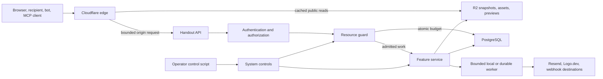

# Handout Protection Architecture Specification

**Status:** Accepted architecture; catastrophic local safeguards implemented, broader resource accounting and production verification pending

**Scope:** Malicious abuse, accidental overuse, cost containment, performance isolation, account and tenant security, public-content trust, and destructive-action recovery

**Audience:** Product, engineering, security, privacy, support, and operations

**Last reviewed:** 2026-07-23

### Implementation checkpoint

The current local implementation enforces the first catastrophic boundaries without introducing a new service or quota framework:

- Origin authentication is required in production and injected by the public Worker and Pages proxy before API body parsing.
- Site JSON is preflighted iteratively and bounded to 5 MiB, 100,000 nodes, 500 media/embed nodes, and 64 document levels; new inline image data is rejected while unchanged legacy data remains editable.
- Individual image imports remain at 5 MiB and now also enforce 8,192-pixel dimensions and 25 megapixels.
- Site creation and duplication use an atomic workspace-row lock for the Free 10-site product limit and the 10,000-retained-site paid safety ceiling.
- Recipient short codes use 96 bits of randomness while legacy codes remain readable; public cadence resolution is read-only and no longer creates recipients or warms Chromium.
- Screenshot execution has one active slot, no waiter queue, a 2 MiB output bound, a 100-request resource bound, and retryable no-store saturation behavior.
- Public cache fills use canonical query-free requests, personalized HTML and previews are no-store, and stale personalized R2 snapshots are no longer written or resurrected.
- Collaboration has bounded messages, encoded state, loaded documents, process connections, and expected origins. The editor waits for initialized collaboration metadata before reading the document.
- MCP requests have transport-byte, depth, and aggregate-value bounds.

This checkpoint is not the completed protection program. Durable multi-scope budgets and resource totals, R2 asset migration, isolated media execution, aggregate storage/version/recipient limits, operator controls, production WAF/rate rules, recovery/audit controls, and production cost verification remain governed by the phases below and must not be represented as already enforced.

## 1. Decision Summary

Handout will protect the product with four small, composable layers:

1. **Bound requests at the edge and API.** Cloudflare handles volumetric traffic, cheap IP-based controls, caching, and challenges. The API independently validates bodies, content, permissions, and resource ownership.
2. **Authorize durable or externally costly work through one resource policy.** A typed API module owns policy and error semantics. Low-frequency durable actions use atomic PostgreSQL counters; high-frequency feature writes enforce their aggregate limit inside the feature's existing transaction so protection does not add a second write or a global hot row.
3. **Keep bytes and optional work away from core database and request paths.** Binary assets and generated previews live in R2. Screenshot rendering, third-party fetches, email, analytics, replay, and automations have bounded concurrency and must not threaten editing or public-page delivery.
4. **Fail proportionately.** Core reads and editing remain available. Optional analytics may sample or drop. A missing personalized preview fails temporarily without affecting the recipient page or poisoning its immutable image URL. Dangerous or destructive writes fail closed with a clear explanation.

This architecture deliberately does **not** add Redis, a new queue provider, a separate abuse service, a machine-learning fraud system, a generic job framework, or a second policy engine. PostgreSQL is the durable authority already used by Handout and Cloudflare is already the public edge. The one deliberate process boundary is a fixed-capacity media worker for screenshot rendering and image decoding: Chromium/decoder native memory and sandbox failure cannot honestly be described as isolated while they run inside the core API.

The resource guard is not middleware around every request. It does not duplicate schema validation, feature idempotency, replay accounting, automation accounting, or query pagination. A control belongs in the narrowest existing transaction that can enforce it correctly; the shared module supplies policy, system state, and consistent decisions.

This document is the cross-cutting source of truth for resource protection. Feature specifications remain authoritative for their product behavior, except where they permit unbounded work. In particular, this specification supersedes any recipient-preview behavior that starts a unique Playwright render merely because a public long link or metadata route was resolved.

## 2. Product Contract

A legitimate customer should not need to understand or manage abuse controls during ordinary use, including reasonable high-volume use.

The normal experience is:

- No CAPTCHA on routine app or recipient traffic.
- No marketed site or recipient limit on paid plans.
- No delay added to recipient navigation for analytics, previews, or third-party services.
- No silent deletion of customer content to recover capacity.
- A clear, actionable explanation when a safety ceiling actually blocks a customer write.
- A support-managed override for a verified legitimate workspace whose expected use exceeds the default safety envelope.
- Cleanup, export, and recovery actions remain available even when a workspace is above a growth ceiling.

Handout nevertheless guarantees internally that:

- One account, workspace, site, recipient, IP range, integration, or public URL cannot create unlimited database, object-storage, email, browser-rendering, or third-party cost.
- Optional subsystems cannot make published sites or the editor unavailable.
- Aggregate storage is bounded even when every individual request is valid.
- Every untrusted collection is bounded by count, byte size, nesting, and retention.
- Every background workload has bounded concurrency, queue depth, attempts, and age.
- Every irreversible action has authorization, auditability, and an appropriate recovery boundary.

## 3. Goals and Non-Goals

### 3.1 Goals

- Establish a calculable maximum resource exposure for each costly subsystem.
- Protect availability against volumetric attacks and valid-request application abuse.
- Protect Neon, Render, Cloudflare, R2, Resend, Logo.dev, Stripe, and future vendors from unbounded use.
- Preserve recipient navigation and core editor behavior under partial failure or attack.
- Keep all limits server-owned, race-safe, observable, and overrideable.
- Minimize personal data used for abuse prevention.
- Provide product-safe recovery from accidental deletion and configuration mistakes.
- Make new costly features adopt protection through one obvious integration point.

### 3.2 Non-goals

- Perfectly identify whether a person is malicious.
- Promise that every legitimate workload fits the default safety envelope forever.
- Build customer-visible usage billing or metering.
- Build an enterprise security information and event management product.
- Retain raw IP addresses, device fingerprints, or cross-site identity for fraud scoring.
- Add infrastructure solely in anticipation of hypothetical scale.
- Use hidden safety ceilings as pricing levers. Any plan-varying storage allowance is a separate documented product entitlement with matching UX; abuse heuristics and emergency global ceilings remain internal.

## 4. Protection Invariants

These invariants are release gates:

1. **Authorization comes before resource admission.** Unauthorized callers do not learn workspace usage or consume another workspace's budget.
2. **The server is authoritative.** Client checks and edge rules improve experience but never establish the hard ceiling.
3. **Counters are atomic.** Concurrent requests cannot all pass a check and exceed the same budget.
4. **Bytes are measured in the representation being limited.** Transport uses observed inbound bytes; stored content uses canonical UTF-8/object bytes after decoding and normalization. Base64 length or a client-provided `Content-Length` is not authoritative.
5. **No unlimited queue exists.** Every waiter list, retry loop, pending row set, upload buffer, and background batch has an explicit maximum.
6. **No unlimited retention exists.** Every mutable snapshot, temporary object, event, preview, invitation, token, and audit record has an owner and retention rule.
7. **Analytics are expendable; customer content is not.** Analytics may be sampled or dropped under pressure. Customer content may be rejected before acceptance but is never silently discarded after a successful write.
8. **Idempotent repetition is cheap.** First-party clients automatically send a stable idempotency key for create, duplicate, restore, publish, import, billing-session, and invitation actions. Retrying returns or reuses the existing result and does not consume a budget twice.
9. **Public delivery is cache-first.** Ordinary recipient page views do not require a new database write, screenshot, email, or third-party fetch.
10. **Feature failure is contained.** Replay, analytics, preview generation, Logo.dev, email, and automations cannot block recipient navigation or editor persistence.
11. **Safety state is visible internally.** Operators can tell what was limited, why, for whom, and whether degradation is active without storing attacker-controlled payloads.
12. **Overrides expire by default.** A temporary accommodation cannot silently become a permanent removal of protection.
13. **Revocation beats availability.** Suspended, unpublished, trashed, or deleted content is never served from a stale cache or snapshot.
14. **Limits constrain growth, not escape.** Reads, export, deletion, cleanup, and recovery remain possible above capacity; only positive net resource growth is blocked.

## 5. Threat Model

### 5.1 Actors

- Anonymous internet traffic and botnets.
- A verified free user intentionally abusing product resources.
- A paid customer whose credentials or API token have been compromised.
- A legitimate customer accidentally importing, publishing, or automating far more than intended.
- A malicious recipient interacting with a public site or its tracking endpoints.
- A user attempting to access another workspace's data.
- A user publishing phishing, malware links, impersonation, or unlawful content.
- A compromised third-party service, dependency, cloud credential, webhook destination, or employee account.
- Normal traffic spikes, vendor outages, malformed files, software defects, and retry storms.

### 5.2 Protected assets

- Availability of recipient sites, the web app, API, editor collaboration, and background workers.
- Customer site content, recipients, assets, analytics, replay, credentials, and billing data.
- Handout's cloud spend, email/domain reputation, legal position, and vendor accounts.
- Other tenants' confidentiality and resource availability.
- Operational ability to recover, suspend abuse, and restore customer data.

### 5.3 Attack and failure classes

- Oversized requests, deeply nested JSON, node explosions, base64 amplification, compressed image bombs, malformed media, and excessive remote resources.
- Unlimited creation of accounts, workspaces, sites, versions, recipients, assets, tracking rows, recordings, collaboration state, invitations, previews, billing sessions, OAuth clients, or webhook work.
- DDoS, cache busting, invalid-path enumeration, origin bypass, slow requests, connection exhaustion, WebSocket floods, and botnet distribution.
- SQL, XSS, HTML/URL injection, SSRF, DNS rebinding, unsafe redirects, malicious embeds, and dependency compromise.
- Credential stuffing, session theft, OAuth abuse, over-broad agent scopes, privilege escalation, IDOR, and cross-workspace query errors.
- Email spam, Logo.dev amplification, Stripe endpoint abuse, webhook amplification, and storage-retention leaks.
- Accidental deletion, bad migrations, lost encryption keys, cache poisoning, runaway cron jobs, and unsafe operator actions.

### 5.4 Existing foundations to preserve

This is a hardening and unification project, not a rewrite. Preserve:

- Route-specific JSON body limits and canonical schema validation.
- Bounded Tiptap strings, collections, nesting, and per-page node counts.
- Public renderer escaping, safe URL protocols, CSP, and iframe sandboxing.
- HTTPS-only remote asset and screenshot loading with DNS/private-network SSRF controls.
- Cloudflare cache-first public delivery and R2 stale snapshots.
- Replay's consent, chunk, duration, event, byte, daily-workspace, and retention limits.
- Automation queue, attempt, retry, timeout, SSRF, signing, idempotency, and retention controls.
- Better Auth's verification and one-time-code protections.

Replace or extend:

- In-memory-only tracking/public-recipient limiting with durable workspace budgets.
- Per-file limits without aggregate storage accounting.
- PostgreSQL binary image storage with R2-backed metadata.
- Public recipient resolution that can create a row and start preview work together.
- Preview concurrency with an unbounded waiter list.
- Unlimited paid site, version, recipient, tracking, collaboration, invitation, and upstream-call safety exposure.
- Hard deletion without a normal recovery window.

## 6. System Architecture



The order is intentional:

1. Edge rules reject or challenge obviously abusive traffic before origin work.
2. Authentication and workspace authorization run before workspace budgets.
3. Cheap structural validation runs before database mutation or external work.
4. The resource guard atomically admits costly work.
5. Feature-specific services preserve their own semantic validation and idempotency.

The media role has one narrow, authenticated internal contract. The API passes either bounded canonical screenshot HTML plus an explicit owned-resource allowlist, or a short-lived GET capability for one quarantine object, along with a deadline and operation identity. The role returns canonical bytes and measured metadata; the API owns database/R2 commits. The media role has no database or general object-store credentials and accepts no caller-selected destination URL. This is a process boundary, not a generic job system.

## 7. The Resource Guard

### 7.1 Ownership

Add one API-owned module:

```txt
apps/api/src/protection/
  policy.ts
  service.ts
  repository.ts
  burst-limiter.ts
  system-controls.ts
  errors.ts
```

`packages/domain/src/limits.ts` continues to own portable document and field limits shared by API, web, MCP, and renderer code. It must not become an operational quota registry.

Feature services call the resource guard immediately before a costly or durable action. Routers do not perform business quota checks directly.

### 7.2 Typed action registry

`policy.ts` exports a closed `ProtectionAction` union and one policy record per action. Initial actions include:

```txt
account.register
workspace.create
team.invitation.send
billing.session.create
site.create
site.duplicate
site.version.create
recipient.create.authenticated
recipient.mutate.authenticated
recipient.create.public
asset.import
preview.render
tracking.session.start
tracking.event.accept
logo.fetch
email.transactional.send
oauth.client.register
oauth.token.exchange
collaboration.connect
```

Each policy declares only the controls it needs:

- Local burst limit.
- Durable hourly, daily, or monthly workspace/principal limit.
- Current resource ceiling.
- Concurrency or queue admission.
- Normal, degraded, and disabled behavior.
- Whether an approved workspace override is supported.

The registry contains no arbitrary executable callbacks and no dynamic expression language. New behavior is added in TypeScript and reviewed like other product code. Transport-specific routes such as MCP call the same domain action as the web app; they do not consume a second generic `mcp.mutation` allowance.

### 7.3 Durable counter model

Add `protection_usage_buckets`:

| Column | Purpose |
| --- | --- |
| `scope_type` | `global`, `workspace`, or `principal` |
| `scope_id` | Stable system scope or authoritative internal workspace/user/API-client ID |
| `action` | Closed protection action |
| `period` | `hour`, `day`, or `month` |
| `period_start` | UTC bucket boundary |
| `quantity` | Accepted work, using `bigint` |
| `updated_at` | Reconciliation and operations |

The primary key is `(scope_type, scope_id, action, period, period_start)`.

All applicable principal, workspace, and global buckets are admitted in one database transaction with the durable feature mutation or durable intent. The transaction creates or locks bucket rows in a deterministic order, verifies `requested <= limit - quantity` using database `bigint`, and increments every required dimension or none. Rejected work does not consume earlier dimensions.

The feature service performs its idempotency lookup before admission and passes the same transaction to the guard repository. A stable operation key that already succeeded returns the original result without another increment. Do not add a generic admission ledger unless a feature cannot share its existing transaction; provider calls use the provider's idempotency contract plus a durable feature intent.

Hourly and daily buckets are retained for 45 days. Monthly buckets are retained for 13 months. An index beginning with `(period, period_start)` makes bounded expiry possible. Quantities have non-negative database checks and never round-trip through a JavaScript `number`. Buckets contain internal IDs and counts only, never IPs, emails, domains, URLs, or request payloads.

Global buckets are reserved for low-frequency durable writes and paid-vendor calls. They are not updated once per tracking event, page view, WebSocket message, or other high-frequency item. Those features apply an edge/local burst bound and update their existing feature-owned aggregate once per accepted batch in the same transaction as persistence. This prevents the protection layer from creating a global or workspace hot row and an extra database write on the hottest paths.

User- or client-initiated storage, vendor, site, recipient, preview, invitation, and bulk tracking actions apply both workspace and principal aggregate policy where one compromised principal could otherwise multiply exposure across many workspaces. Public campaign capabilities enforce their own campaign budget plus workspace/global policy.

UTC buckets are simple accounting boundaries, not burst protection. Hourly/local limits and concurrency bounds cover the near-2× burst possible across a daily boundary, and the capacity-and-cost worksheet includes that boundary multiplier.

### 7.4 Current resource totals

Add `protection_resource_totals`:

| Column | Purpose |
| --- | --- |
| `scope_type`, `scope_id` | Workspace or user ownership boundary |
| `resource` | Closed resource name |
| `quantity` | Current bytes or count |
| `updated_at` | Last mutation |
| `reconciled_at` | Last authoritative repair |

Initial resources are:

- `site_count`
- `active_workspace_count`
- `asset_bytes`
- `asset_count`
- `preview_bytes`
- `preview_count`
- `active_recipient_count`
- `retained_recipient_count`
- `recipient_bytes`
- `tracking_metadata_bytes`
- `tracking_manifest_count`
- `collaboration_state_bytes`
- `site_content_bytes`
- `site_version_bytes`
- `tracking_event_bytes`
- `tracking_event_count`
- `tracking_session_count`

Resource totals are updated once per feature transaction or batch, in the same transaction as authoritative metadata. Capacity checks apply only to a positive delta. Zero/negative-delta edits, export, deletion, purge, and cleanup remain admitted above capacity. An idempotent bounded reconciliation job periodically recomputes totals from authoritative metadata and repairs drift. Drift is an alert, not an excuse to remove enforcement.

For object uploads, insert a hidden `pending` metadata row and reserve the maximum simultaneous temporary plus final capacity before sending bytes to R2. After canonical encoding, atomically reduce the reservation to observed quarantine plus canonical size and finalize only after the canonical object write succeeds. Bytes and object count remain charged until each R2 deletion is confirmed or absence is verified; requesting deletion is not enough. A process crash may temporarily consume too much quota, but the pending row gives reconciliation the object keys and intended sizes to repair it; the crash must never permit actual storage to exceed the ceiling.

Pending rows and deletion outboxes have count, byte, age, and batch ceilings. New storage-producing work degrades when deletion backlog crosses a safe watermark. Reconciliation never frees accounting merely because deletion was enqueued.

### 7.5 Overrides

Add `protection_overrides`:

| Column | Purpose |
| --- | --- |
| `id` | Audit identity |
| `scope_type`, `scope_id` | Global, workspace, or principal |
| `action_or_resource` | Exact controlled dimension |
| `limit` | Replacement hard ceiling |
| `reason` | Operator-authored, no customer content |
| `expires_at` | Required unless explicitly permanent |
| `created_by` | Operator identity |
| `created_at`, `revoked_at` | Audit history |

An override raises or lowers a ceiling; it never skips validation, authorization, file safety, tenant isolation, or global concurrency limits.

The initial operational interface is a typed repository script, for example `pnpm protection:override`, rather than a new admin web application. It validates the environment, exact action, scope, value, expiry, and operator reason; previews the change; requires explicit confirmation for production; writes idempotently; and records the individual operator before mutating state. A read-only `pnpm protection:inspect` command shows usage, effective limit, reset time, override expiry, recent coalesced enforcement state, and applicable cleanup guidance. Operators are warned before a live override expires.

### 7.6 Runtime system controls

Add `system_controls` with a closed control name, mode, reason, operator, and update timestamp. Modes are:

- `normal`
- `degraded`
- `off`

Initial controls:

- `account_registration`
- `workspace_creation`
- `asset_import`
- `public_recipient_creation`
- `personalized_preview_rendering`
- `tracking_ingestion`
- `replay_ingestion`
- `logo_fetching`
- `transactional_email`
- `automation_delivery`

The API caches controls for no more than five seconds. Each control has a compiled safe default and maximum stale age. On cold start or expired state, optional/costly work degrades and dangerous writes fail closed; cached public reads and ordinary authorized reads remain available. Changes are made through a typed operations script and are audited. Turning a control off must not require a deploy.

Provider-capacity watermarks alert but do not mutate product state. The initial system has only the typed operator command; automatic control changes are out of scope until an incident demonstrates the need.

### 7.7 Local burst limiting

A small bounded in-process token bucket remains useful for protecting a single API process from immediate CPU or connection spikes. It:

- Has an explicit maximum key count and expiry.
- Uses opaque user/workspace IDs or ephemeral HMAC network keys.
- Is defense in depth, not the durable cost ceiling.
- Is never described as globally authoritative.

Anonymous IP bursts belong primarily at Cloudflare. Raw IP addresses are not persisted in application tables.

### 7.8 Standard decisions

The guard returns a typed decision. Feature-specific fallback is a closed discriminated type owned by that feature, not an arbitrary string:

```ts
type ProtectionDecision =
  | { outcome: "allow"; remaining?: number }
  | { outcome: "degrade"; code: string; retryAt?: string }
  | { outcome: "reject"; code: string; retryable: boolean; retryAt?: string };
```

Feature code maps `degrade` to a feature-specific safe behavior. It may not silently reinterpret `reject` as success for a customer-content write.

HTTP mappings are consistent:

- `413` for a request body rejected before semantic processing.
- `422` for structurally valid input that violates content safety limits.
- `429` with `Retry-After` for a temporal burst or usage budget.
- `409` with a typed `resource.capacity_reached` error for current stored-resource capacity.
- `503` with bounded retry guidance when an operator control or dependency makes an essential action temporarily unavailable.

API responses do not reveal exact anti-abuse heuristics. Authenticated workspace admins may receive a controlled resource/unit, current stored-resource usage where useful, whether retrying unchanged input can succeed, an absolute reset time, and exactly one applicable next step. Upgrade is shown only when a documented plan entitlement changes the limit; otherwise the next step is retry, cleanup, or support.

## 8. Failure and Degradation Policy

| Workload | At limit or dependency failure |
| --- | --- |
| Cached public HTML, assets, or preview | Serve current cache or explicitly allowed stale snapshot only after the edge has confirmed there is no revocation tombstone. |
| Uncached public HTML | Fetch origin within timeout; serve the one eligible non-personalized published snapshot or unavailable page. Never wait for analytics or third parties. |
| Site-content save | Reject before persistence with a specific size/capacity message. Preserve the last saved revision and keep the rejected draft editable in the current browser session. |
| Asset upload | Reject before acceptance. Never claim success without durable metadata and object ownership. |
| Public recipient creation | Reuse an existing normalized recipient. New durable creation requires an authenticated pre-provisioning flow or a valid owner-issued campaign capability. If creation is unavailable, use the published default only when it is explicitly safe; otherwise show a neutral unavailable page. Notify the workspace once per affected interval. |
| Personalized preview | Serve an already-cached personalized preview. A miss renders only when immediately admitted; otherwise return a non-cacheable temporary failure. Never put generic bytes under the personalized immutable URL. Recipient navigation remains personalized. |
| Tracking events | Accept the HTTP transport but sample or drop excess events without retries. Increment only aggregate drop metrics. |
| Replay | Decline new replay starts or truncate an admitted recording. Event tracking and the site continue. |
| Collaboration | Reject a new connection or oversized update. Existing saved content remains intact. Recovery save is available only with an optimistic draft-revision check and never overwrites a collaborator's newer revision. |
| Logo.dev | Serve an R2 cache hit, workspace logo, recipient initial, or no logo. |
| Invitation or email | Reject the sender action with a cooldown; never delay unrelated product work. |
| Automation | Pause admission/delivery according to the automation state model. Tracking continues. |
| Billing portal/checkout | Reject excessive creation with retry guidance. Existing subscription state is unchanged. |

Degraded behavior must never cross tenant boundaries, substitute one recipient's data for another, or make a destructive mutation look successful.

## 9. Edge, DDoS, and Origin Protection

### 9.1 Routing

- `handout.link`, `app.handout.link`, and `api.handout.link` remain Cloudflare-proxied production entry points.
- Public HTML, immutable runtime assets, workspace assets, logos, and previews use explicit cache policies.
- Render's provider hostname is not linked or used by clients.
- Authenticated edge-to-origin ingress is a production release gate. Prefer provider firewalling or private ingress; otherwise Cloudflare injects a rotatable origin secret that the API validates before request parsing, with narrowly authenticated internal-service and health-check paths. The public Render hostname is rejected and never functions as an alternate API.
- Same-origin app API requests continue through the Pages proxy. MCP remains on the protected API hostname and uses its own authentication.

### 9.2 Edge rules

Use a small number of rules organized by cost:

1. Managed WAF rules for common exploits.
2. Challenge repeated signup, login, password-reset, OAuth-registration, and invitation abuse.
3. Challenge or limit high-cardinality invalid public paths.
4. Limit public recipient creation separately from cached public reads.
5. Limit tracking session starts separately from batched event submission.
6. Protect asset, logo, and screenshot cache misses more strongly than cache hits.

Routine valid recipient page loads are not challenged. Rules should count a privacy-preserving combination of IP, route class, and known site identifier where supported.

Cloudflare rules and origin-secret configuration are version-controlled or exported beside deployment configuration and production-smoke-tested. Dashboard-only state is not the source of truth. Edge rate limits are intentionally defense in depth: their counters may be location-scoped, and application storage/vendor ceilings remain authoritative.

API write routes accept only their declared methods and content types. Compressed request bodies are rejected unless a route explicitly implements a decompressed-byte and compression-ratio limit. Header count/size, request duration, and idle connection limits are enforced at the edge or hosting layer and verified in production.

### 9.3 Cache behavior

- Public page cache keys include only canonical routing inputs.
- Dynamic long-link recipient resolution remains `no-store`.
- Invalid public IDs and short codes receive a brief negative cache only after strict syntax validation.
- Immutable asset and preview URLs include a content or revision identity and use long-lived edge caching.
- Public asset and logo routes must be edge-cacheable; ordinary repeated loads must not query Postgres or Logo.dev.
- Requests with attacker-controlled query parameters must not create unbounded cache keys. Only declared version parameters participate in cache identity.
- Stale-on-error is allowed only for a current, non-personalized published snapshot and never for authorization-sensitive app data or per-recipient HTML.
- Unpublish, site/workspace suspension, trash, deletion, and capability revocation publish a small edge-readable tombstone and purge relevant cache keys. The Worker checks tombstones before cache or R2 delivery. A tombstone always wins over stale content and has a tested maximum propagation time.
- R2 keeps at most one stale HTML snapshot per non-personalized published-version identity. Per-recipient HTML may use bounded edge caching but is never persisted as an R2 stale snapshot.

## 10. Site Content and Editor Protection

### 10.1 Canonical content limits

Retain schema-level string, node, mark, nesting, page, variable, and collection bounds. Add:

- Maximum normalized serialized `SiteContent`: 5 MiB.
- Maximum total Tiptap nodes across the site: 100,000.
- Existing maximum per page: 10,000 nodes.
- Maximum remote media/embed resources across a site: 500.
- Maximum accepted JSON nesting for unknown configuration values: 8.
- Maximum decoded and normalized string length is enforced before persistence, rendering, tracking-manifest generation, or agent output.

The API calculates normalized UTF-8 bytes from the validated object. Request-body limits remain slightly higher to allow JSON syntax overhead, but a large body can never bypass the canonical content limit.

### 10.2 Inline data

New writes must not persist `data:` image bodies inside site content, variables, collaboration state, or variants. Images are imported as assets and referenced by opaque asset identity.

Existing inline images remain readable during migration. The editor migrates them through the canonical asset importer on the next intentional save. Publication of a legacy inline image may continue during a bounded compatibility period, but new inline bytes are never added.

Migration is best-effort and atomic: the legacy reference remains until the imported asset is durable, and an unrelated text/content save does not fail merely because asset importing is saturated, disabled, or above capacity.

### 10.3 Collaboration

Collaboration remains a projection of canonical `SiteContent`, not a second document model. Enforce:

- 10 active collaboration connections per user.
- 25 active connections per site.
- 100 active connections per workspace.
- 512 KiB maximum incremental WebSocket update.
- 5 MiB maximum encoded Yjs document state.
- Aggregate collaboration-state storage follows the workspace protection envelope.
- Bounded loaded-document count and aggregate encoded bytes per API process with idle eviction.
- Authentication before document load.
- Strict expected-origin validation before a cookie-authenticated WebSocket upgrade, authorization on every document subscription, bounded authentication time, idle timeout, connection-attempt/message-rate bounds, and disconnect on session or membership revocation.
- Canonical `SiteContent` validation before a collaboration save is published as the draft revision.

An oversized or invalid Yjs state is rejected and the last valid draft remains authoritative. A collaboration failure must not corrupt the REST draft or prevent the site from being opened in recovery mode. Recovery mode visibly disables live presence and saves with the last observed draft revision; a conflict requires reload/merge and never becomes a last-writer-wins overwrite.

The initial fixed deployment may enforce connection limits per process. The true maximum is therefore the per-process ceiling multiplied by the configured maximum API instance count, and that product is included in the memory/connection budget. Do not add database heartbeat rows for live connections; introduce distributed presence admission only if a measured multi-instance deployment needs a tighter global number.

## 11. Asset and Object-Storage Protection

### 11.1 Storage ownership

Move workspace assets, workspace logos, and user profile images from PostgreSQL `bytea` to private R2 objects. PostgreSQL stores:

- Opaque object key.
- Workspace/user owner.
- Content hash.
- Media type.
- Encoded byte size.
- Width, height, and pixel count.
- Purpose and safe file name.
- Creation and deletion state.

Object keys never contain customer names, emails, domains, or original URLs.

### 11.2 Image processing

Accepted raster formats remain PNG, JPEG, and WebP. For each upload:

1. Authorize an upload intent, reserve declared inbound bytes plus the maximum canonical output and both temporary/final object counts, and create one hidden pending metadata row.
2. Issue a short-lived, create-only signed PUT to an opaque private quarantine key. The signature binds exact content length, declared media type, and a create-only condition. If the provider path cannot enforce all three in a real browser upload, use a bounded streaming upload gateway instead.
3. On finalize, verify the observed object size/type against the reservation before download.
4. Stream the quarantined object to a byte-capped temporary file in the isolated media worker; do not retain the complete encoded body in process memory.
5. Verify actual format, then read dimensions/frame metadata with decoder-level pixel/frame limits before full decode.
6. Reject animations unless the feature explicitly supports and bounds frame count.
7. Decode/re-encode under the measured dimension/pixel/memory ceiling, strip metadata, and calculate a content hash.
8. Write the canonical private object and atomically adjust accounting to actual canonical plus observed quarantine bytes, then mark metadata available.
9. Keep the quarantine object and its bytes charged until the signed capability has expired, then confirm deletion and release only its portion of the reservation. A reusable presigned URL can therefore never recreate an unaccounted object after finalize.

The canonical stored object remains at most 5 MiB. The inbound transport ceiling is a separate, modestly larger value chosen from legitimate photo p99/p99.9 measurements; it is never inferred from the canonical output ceiling. Output bytes, input bytes, dimensions, pixel area, frame count, decode time, and peak process memory are independently bounded. Future document, archive, video, audio, or SVG uploads require a separate threat model and are not implicitly accepted by this design.

Browser uploads move from base64-in-JSON to the direct quarantine intent/finalize flow. Active intents are count/byte-bounded per principal and workspace, expire quickly, and have an R2 lifecycle backstop. URL imports remain a small JSON request and use the same quarantine/validation path after bounded SSRF-safe fetch. The API does not issue a final public object URL until validation, re-encoding, storage, metadata ownership, and quarantine cleanup state are known.

Intent creation and finalize are idempotent. Repeated finalize returns the same ready asset or current pending status; it never creates another canonical object or consumes capacity twice. Media saturation leaves the quarantined object reserved and retryable until the explicit intent expiry.

Image decoding and preview rendering run in the one media role outside the core API and share a host-level heavy-work memory budget rather than independent unmeasured concurrency limits. On the smallest capacity, start with one active heavy task per media instance and no in-memory waiter queue, then raise only from measured worst-case RSS. Saturation rejects with bounded retry guidance before decode. Temporary files have a specific directory, aggregate byte/count ceiling, timeout, and guaranteed cleanup path.

Physical asset deduplication is not part of the initial move to R2. Logical duplicates may store separate canonical objects and remain correctly accounted. If measured storage makes deduplication worthwhile later, add an explicit workspace blob/reference model and a unique canonical-hash constraint; never bolt refcount behavior onto ordinary asset rows.

Pending asset or preview rows are not listable or serveable. A bounded reconciler repairs or deletes rows left pending beyond 15 minutes and removes the corresponding uncertain object before releasing reserved capacity.

Remote imports retain HTTPS-only SSRF controls, DNS resolution and pinning, redirect revalidation, private/special-address blocking, timeouts, byte caps, and response-type verification.

### 11.3 Lifecycle

- User deletion removes the product reference immediately and enqueues durable object deletion.
- Failed or abandoned uploads are reconciled and deleted.
- Superseded profile images and workspace logos are deleted after a short rollback window.
- Temporary public HTML snapshots and incomplete/quarantined uploads have R2 lifecycle backstops.
- Replay follows its existing shorter consent-based retention.
- Recipient previews follow the preview retention contract in Section 13.
- Application deletion remains authoritative; provider lifecycle rules are defense in depth.

## 12. Sites, Versions, Workspaces, and Recipients

### 12.1 Workspaces and sites

- Free retains its product limit of 10 sites.
- Paid plans remain product-unlimited, subject to an internal 10,000-retained-site workspace safety ceiling. Active, archived, and trashed site rows all count until confirmed permanent purge.
- A user may create at most 5 workspaces per UTC day and have 20 active workspaces without an override.
- A paid workspace may create or duplicate at most 200 sites per UTC day by default.
- First-party creating, duplicating, restoring, and publishing always use an automatically generated stable idempotency key.
- Archived sites continue to consume storage until deleted or expired by an explicit trash policy.

The paid safety ceiling is not marketed as a plan feature. Approaching it creates an internal support signal and an in-product contact path before it blocks a verified customer.

### 12.2 Version storage

Every site version stores:

- Normalized content byte size.
- Deterministic content hash.
- Kind and reference state.

Do not create a new version when its content hash, variables snapshot, and semantic kind are identical to the latest eligible version.

Version allocation locks the owning site row through hash recheck, version creation, and published/draft pointer update, or uses an equivalent atomic sequence. Concurrent publish/restore requests cannot allocate the same number or create duplicate semantic versions.

Retain:

- The current published version.
- The most recent 100 versions per site.
- Explicitly protected restore points.

Tracking and replay keep their own bounded immutable display/snapshot data and do not pin complete site versions. Historical version IDs may remain as nullable identity. A bounded maintenance job removes older unprotected versions and decrements version storage totals. A workspace at its version-storage ceiling may make zero/negative-growth edits and delete/unprotect history; publish/restore that requires positive growth waits until eligible history is pruned or capacity is raised.

### 12.3 Recipients

- Continue normalized idempotent upsert by site-scoped recipient identity.
- Keep batch requests at 100 recipients and 2 MiB normalized bytes. Each API batch is atomic with indexed validation errors; first-party importers chunk by both limits and reuse stable idempotency keys.
- Limit normalized serialized recipient variable values to 64 KiB per recipient and only declared variable keys.
- Store normalized byte size alongside the recipient so aggregate recipient storage is accountable without repeatedly serializing every row.
- Default authenticated creation ceiling: 100,000 new recipients per workspace per UTC day.
- Default authenticated revision-changing mutation ceiling: 200,000 per workspace per UTC day.
- Default public long-link creation ceiling: 25,000 new recipients per workspace per UTC day.
- Default current active-recipient safety ceiling: 1,000,000 per workspace.
- Default retained-recipient-row ceiling: 1,250,000 per workspace, including soft-deleted rows until confirmed purge.
- Limit a decoded public long-link path plus query to 8 KiB and reject unknown or duplicate variable keys before persistence.
- Soft-deleted recipients count toward retained storage and become eligible for permanent purge after 30 days once no unexpired tracking/replay reference requires them. Historical analytics rely on their safe snapshots rather than keeping the complete recipient variable map indefinitely.
- Repeated access to an existing recipient and unchanged idempotent upserts do not consume creation or mutation allowances.

Recipient URLs are bearer capabilities. New short codes contain at least 96 bits of cryptographic randomness, are never reused, and are not protected merely by rate limiting. Existing six-character codes are rotated before broad distribution. If any were already sent, owners receive replacement links and a bounded notice window; the low-entropy URL then becomes unavailable and never redirects to reveal the replacement capability.

An ordinary public site identifier never authorizes a database write. Durable recipient creation uses one of:

1. Authenticated batch pre-provisioning, which is the default and reliable campaign path.
2. A short-lived, owner-issued campaign capability scoped to one site, an explicit recipient count/byte budget, allowed variable keys, and expiry. Invalid capabilities fail before site lookup or budget consumption.

Raw recipient names, companies, domains, and custom values are not placed in new public resolver paths or query strings. New integrations pre-provision opaque links. A legacy template resolver that cannot pre-provision is compatibility-only, receives the stricter campaign capability and logging rules, and has an explicit removal plan; its existence is not treated as the target architecture.

Campaign rows/capabilities are count-bounded, revocable, stored hashed, and expire within 30 days. Expired/revoked rows are purged after a short audit window. Use atomically decrements the campaign count/byte allowance in the same transaction as recipient creation; idempotent reuse does not consume it twice.

When public creation is degraded, use the non-personalized published site only if publish validation proved that every variable has a safe default and the generic page is intentionally recipient-safe. Otherwise show a neutral unavailable page. Record one coalesced workspace notice per affected interval with pre-provisioning guidance; never expose another recipient's values or silently make a campaign appear fully personalized.

Because the compatibility campaign resolver can contain recipient name, company, domain, and variables, application logs, traces, metrics, and error messages record only the route template and request ID—not the raw path or query. Public responses use `Referrer-Policy: no-referrer`. Provider access-log retention and access are treated as sensitive infrastructure data. This containment does not make PII-bearing URLs the target architecture.

For every first-party campaign, authenticated batch pre-provisioning produces exact links before send time and avoids turning recipient page views into write traffic. Campaign/export tooling refuses to distribute more lazy links than the remaining campaign capability can safely create.

## 13. Recipient Preview Protection

### 13.1 Rendering admission

Personalized screenshots are generated only for an actual versioned image request or an explicit authenticated preview action. Resolving a public recipient link, fetching HTML metadata, or redirecting a long image URL does not itself launch Chromium.

Rendering has:

- A fixed-capacity isolated media role with no database, Stripe, Resend, OAuth, automation, or broad R2 credentials.
- One active render on the smallest production capacity initially; concurrency may rise only after measured worst-case CPU and resident-memory proof.
- No public waiter queue. A public miss claims an immediately available slot or returns a temporary failure.
- A tiny bounded authenticated pre-generation queue only if sender-facing measurements prove it is needed.
- A unique pending preview row/lease keyed by immutable preview identity, so multiple API processes cannot render the same image concurrently.
- Plan policy allows up to 100 Free or 10,000 paid newly rendered personalized previews per workspace per UTC day.
- Principal and global hourly execution ceilings in addition to the workspace daily ceiling.
- No automatic retry loop beyond the requesting operation.

Chromium does not run in the core API availability domain. It runs in the media role with its sandbox enabled, an ephemeral browser context, OS/container CPU-memory-process limits, and JavaScript disabled unless the canonical renderer proves it is required. Its network policy allows only same-origin owned assets and a closed reviewed provider-host registry; it never performs arbitrary browser DNS fetches. Screenshot and image-decode tasks share the role's one measured heavy-work budget. The configured maximum media-role instance count and concurrency form the hard global execution envelope and are never workspace-overrideable.

### 13.2 Preview fallback

Each publish version has one separate non-personalized preview cache identity. It is rendered only on its own actual image request or an explicit authenticated pre-generation action. One request launches at most one render; a personalized miss does not first generate a generic image. Publishing itself never waits for Chromium or R2.

When a personalized preview is cached, serve it. When a new personalized render is not immediately admitted or fails, return `503` with `Retry-After` and `Cache-Control: no-store` from the image endpoint. Recipient HTML/navigation remains available.

Never return generic or placeholder bytes with `200` under an immutable personalized preview URL. Email and social image proxies do not reliably honor origin cache instructions; doing so can pin the wrong image long after capacity recovers.

Authenticated share surfaces explicitly pre-generate and verify the personalized object before enabling image-copy/email insertion. If it is not ready, they show a clear retry state and keep link-only sharing available; they never present a generic image as personalized success. Public metadata may reference the separate versioned non-personalized preview URL only when product behavior intentionally chooses a generic preview before a personalized object exists.

### 13.3 Storage and retention

- Add `generated_previews` metadata keyed by immutable workspace, site, publish-version, recipient, and revision identity. Store object key, byte size, content hash, state, and timestamps; never store rendered bytes in PostgreSQL.
- The API owns preview admission/orchestration, the durable R2 write, and metadata accounting through the same bucket-scoped object-store abstraction used by other API-owned objects; the media role only returns bounded JPEG bytes. The Worker remains the cache-first reader. This replaces a Worker-only asynchronous write path that cannot authoritatively account for storage.
- Preview keys contain opaque workspace, site, publish-version, recipient, and revision identities.
- Repeated requests reuse the same R2 object.
- The current non-personalized site preview remains while referenced by the current published version.
- Personalized previews have a disclosed 90-day maximum retention from creation, shortened to 30 days after recipient/site deletion unless a legal hold applies. After expiry, the old URL returns a temporary non-cacheable failure or redirects to the separate current generic preview URL; it never becomes a broken cross-tenant reference and is never regenerated from deleted recipient data.
- Preview byte and object totals are included in workspace storage accounting.
- Preview metadata has both byte and object-count ceilings. Expiry removes oldest eligible objects in bounded batches so legitimate ongoing campaigns can recover capacity. If all retained objects are still inside the disclosed window and capacity is reached, cached objects continue to serve while new personalized renders return the temporary failure.

## 14. Public Delivery and Remote Resources

- Public HTML never waits for tracking, preview rendering, email, Logo.dev, or automation delivery.
- Published raster content uses a Handout asset identity or an explicitly approved cached provider path. A pasted arbitrary HTTPS image is imported through the safe asset service before it becomes published content; recipient browsers do not hotlink customer-controlled image hosts.
- Personalized image variables resolve to owned assets or reviewed same-origin proxy routes. They may not introduce an arbitrary browser-side fetch that leaks recipient network information.
- Approved third-party embeds remain visibly third-party, use `Referrer-Policy: no-referrer`, and receive only the minimum sandbox/permissions required by the provider registry.
- The renderer caps the number of remote images and embeds emitted by one site.
- Screenshot capture applies its own remote-request count, total downloaded-byte, DNS, redirect, and per-resource timeout limits.
- Public title logos and workspace assets use immutable, cacheable Handout URLs.
- Image proxy endpoints may resolve only a site/workspace-authorized resource or a normalized cached provider domain. They are not arbitrary URL fetchers.
- Unknown public codes use syntax checks and short negative caching before database lookup.
- Cache-busting query parameters are ignored or rejected unless explicitly part of the route contract.

## 15. Tracking and Replay

### 15.1 Event tracking

Event tracking remains first-party, privacy-minimized, and nonessential to page behavior.

Add durable workspace ceilings:

- 25,000 accepted session starts per UTC day.
- 250,000 accepted modeled events per UTC day.
- 500 accepted events per session.
- Retained session/event count and normalized-byte ceilings, enforced before persistence.
- A server-owned maximum event/session retention; workspace privacy settings may shorten it but never make it unbounded.
- Existing request body, batch, token, same-origin, schema, and idempotency limits remain.

Tracking does not call the generic guard once per event. The service applies the accepted count/bytes once per batch in the same transaction as its inserts and feature-owned daily aggregate. Edge and bounded in-process limiting reject obvious bursts before this transaction. This keeps exact storage admission without adding a second hot-path write.

When a workspace exceeds a ceiling:

- New sessions may be sampled deterministically by signed session identity.
- Excess interaction events are dropped.
- The ingest endpoint returns success without instructing the browser to retry.
- Site navigation and interactions are never delayed.
- Every dashboard and export that includes the affected interval visibly marks it partial/incomplete.

Sampling is workspace-isolated and stable enough to avoid bias from repeated retries. It does not create a persistent visitor identifier.

Sampled totals are not silently extrapolated. Any future estimate must name and test its methodology separately.

Tracking manifests and other immutable display metadata store normalized byte size and count toward `tracking_metadata_bytes`. Unreferenced manifests created for contexts that never start a session are removed after seven days; manifests referenced by retained sessions/events follow analytics retention. Repeated rendering of the same publish-version and recipient revision reuses one manifest identity.

### 15.2 Replay

Keep the existing replay architecture and limits:

- Pro and consent gating.
- 5 MiB and 20,000 events per recording.
- Bounded chunks and duration.
- Daily workspace recording and compressed-byte ceilings.
- Private R2 objects and bounded retention.
- Durable object-deletion outbox.

Replay admission uses the shared protection decision only for system-wide degraded/off state. Its detailed aggregate enforcement remains in the replay service because recording transactions and completion semantics are feature-specific.

### 15.3 Analytics retention

Events, sessions, manifests, and replay continue to follow their privacy/product retention settings. Retention jobs:

- Operate in bounded batches.
- Use a single-flight lease.
- Stop after an explicit work ceiling.
- Exit nonzero and alert when work remains beyond that ceiling or object deletion fails.
- Never run duplicate in-process and external schedulers simultaneously.

Provider/product retention settings are capped by the server maximum and retained-resource ceilings above. A valid daily allowance repeated indefinitely therefore cannot grow PostgreSQL without bound.

## 16. Authentication, Accounts, Teams, Billing, and Agents

### 16.1 Authentication

- Keep email verification, hashed one-time codes, short expiries, and attempt limits.
- Make authentication rate limiting distributed or enforce equivalent Cloudflare protection before relying on it as authoritative.
- Enforce registration admission through a Better Auth lifecycle hook/plugin before user persistence; do not route-sniff or build a parallel signup path. Login, verification, and reset burst controls remain at Cloudflare and Better Auth.
- Use adaptive Turnstile after suspicious volume or repeated failures, not on every normal login.
- Require verified email before creating workspaces, importing assets, publishing, inviting teammates, creating billing sessions, or connecting an agent.
- Signup, login, verification, and reset responses do not reveal whether an email already has an account beyond the product's intentionally authenticated flows.
- Failed authentication throttling avoids a permanent attacker-triggered account lockout; successful verified recovery remains possible.
- Add MFA/passkeys for users and require recent authentication for changing email/password, revealing or rotating secrets, managing OAuth clients, deleting a workspace, and changing billing administration.
- Sessions and connected applications have user-visible revocation.
- Password/email/security changes send idempotent notifications.

### 16.2 Teams and email

Initial invitation controls:

- 10 invitation sends per actor per hour.
- 50 invitation sends per workspace per UTC day.
- Three sends to the same normalized email per workspace per UTC day.
- Upsert and resend an existing pending invitation instead of creating duplicates.
- Enforce the subscribed seat model before sending.

The per-address resend window lives atomically on the existing pending invitation record; the generic protection table does not add an email-address scope or persist an email hash.

Transactional email calls have idempotency keys and bounded retries. A Resend outage never blocks the underlying workspace transaction when the email is informational; actions that depend on possession of the email fail honestly and remain retryable. Email admission has priority classes: invitations, welcome mail, and other optional sends stop first; verification, recovery, and security notices use a reserved pool unless email is disabled because the provider or credential is unsafe.

Welcome emails are once per user/workspace intent, not once per API retry.

Expired, revoked, and accepted invitation rows are removed after 90 days unless they are still needed by the security audit record. The audit record retains the action and internal target identity, not the complete invitation payload.

### 16.3 Billing

- Checkout and portal sessions require workspace admin permission and recent authentication.
- Limit creation to 10 sessions per user/workspace per hour.
- Reuse a still-valid session when the provider contract allows.
- Stripe webhooks retain raw-body signature verification, idempotent event processing, controlled event types, and no trust in client-reported subscription state.
- Billing abuse cannot change the authoritative plan without a verified Stripe event.
- Keep card data entirely in Stripe-hosted surfaces and enable Stripe's payment-risk controls. A successful or disputed payment never exempts a workspace from safety ceilings.
- Subscription cancellation, payment failure, dispute, and refund behavior follows one documented entitlement grace policy; webhook retries cannot repeatedly transition or duplicate the same billing state.

### 16.4 MCP and API clients

- MCP and future public APIs call the same feature services and resource guard as the web app.
- Agent retries use idempotency keys and revision checks.
- The OAuth grant UI names the workspace and requested capabilities.
- Replace the single broad operational scope with narrower read, content-write, publish, recipients, tracking-read, automation, and destructive scopes before third-party distribution requires them.
- Publish, team visibility, restore, billing, secret access, and deletion require explicit user intent and recent authorization where appropriate.
- Token and tool output never expose internal secrets, binary data, raw tracking payloads, or another workspace's usage.

Dynamic OAuth client registration is itself an untrusted write:

- Strictly bound metadata, client-name, redirect-URI count, and serialized bytes.
- Allow only HTTPS redirect URIs, with an explicit loopback exception for reviewed native/development clients.
- Apply edge burst protection and a global bounded registration budget.
- Expire never-authorized registrations after seven days.
- Cap active connected clients per user at 50 unless reviewed.
- Token, code, refresh, and registration retries are idempotent and rate-limited.
- Redirect-URI matching is exact; wildcard, fragment, credential, and open-redirect patterns are rejected.

## 17. Third-Party and Automation Protection

### 17.1 Logo.dev

- Cache successful normalized-domain logos in R2 for 30 days.
- Cache not-found results for one day.
- Deduplicate concurrent fetches by normalized domain, size, and theme.
- Cap upstream response bytes and total redirects; use strict timeouts.
- Bound global concurrency.
- Default to 5,000 unique uncached provider-domain fetches per workspace per UTC day.
- Open a circuit after sustained provider failures and use workspace logo, recipient initial, or no-logo fallback.

Browser clients never receive the provider token or call Logo.dev directly.

### 17.2 Automations

The existing automation architecture remains canonical:

- Pro gating.
- Workspace and per-automation queue caps.
- Monthly attempt ceiling.
- Bounded retries and concurrency.
- HTTPS-only SSRF protection, DNS pinning, no redirects, and timeouts.
- Idempotency and HMAC signatures.
- Payload/activity retention.
- Needs-attention and plan/usage pause states.

Automation events are admitted only after tracking persistence commits. An automation outage or quota never rejects or retries the original visitor event.

### 17.3 Future vendors

Every new paid or rate-limited vendor integration must declare:

- Which protection action admits a call.
- Cache and idempotency behavior.
- Timeout and concurrency limit.
- Retry count and maximum retry age.
- Circuit-breaker behavior.
- Maximum response bytes.
- Secret and logging policy.
- User-visible fallback.
- A worst-case daily cost at the configured ceiling.

## 18. User-Generated Content and Recipient Safety

Technical XSS prevention does not address phishing, impersonation, or abusive content. Add a small trust-and-safety model:

- Public sites expose a discreet **Report this page** action.
- Reports create a bounded `abuse_reports` record containing reporter category, controlled reason, site identity, optional short explanation, status, and timestamps.
- Reporter submissions are rate-limited/challenged, count-bounded, escaped in every staff surface, and do not reveal customer identity.
- A workspace enforcement state supports `active`, `read_only`, and `suspended`.
- `read_only` preserves authenticated read/export/delete/appeal access while blocking other mutations; `suspended` additionally disables all public delivery through the revocation contract.
- Reports alone never change enforcement state automatically. They coalesce for review so brigading cannot suspend a customer.
- Site suspension immediately disables public delivery and republishing through the revocation contract while preserving evidence. Authorized owners may still privately edit, export, delete, and appeal so they can remediate.
- A site-level public suspension is available when one site, rather than the entire workspace, is harmful.
- Workspace-wide read-only or suspension is a reviewed escalation. Visitors see the same neutral unavailable page and never a reason that exposes investigation details.
- Support has a documented review, notice, appeal, preservation, and takedown procedure.
- Initial review and enforcement use the existing support queue plus typed inspect/suspend commands; do not build a trust-and-safety admin application for v1.
- Report explanations are capped at 1,000 characters, attachments are not accepted in v1, duplicate reports coalesce, and report rows/bytes are capped. Closed report details have a normal 180-day maximum unless a separately scoped legal/evidence hold applies.
- Custom domains and sender-domain verification are preferred trust signals; Handout branding must not imply endorsement of customer content.
- Search indexing remains disabled until an explicit trust decision introduces verified ownership, indexing controls, spam response, and removal tooling.

Custom domains require a per-domain ownership challenge, globally unique binding, certificate issuance only after proof, periodic revalidation, immediate routing/certificate removal on detach or suspension, and a quarantine before reassignment. A dangling or previously verified DNS record never authorizes a new workspace automatically.

For embeds:

- Maintain one provider registry with allowed URL patterns and required sandbox capabilities.
- Unknown embed providers degrade to a safe external link rather than an arbitrary active iframe.
- Do not grant top navigation, downloads, popups escaping the sandbox, camera, microphone, clipboard, or payment permissions unless a reviewed provider feature requires them.

## 19. Application and Tenant Security

### 19.1 Tenant isolation

- Every repository query involving workspace-owned data includes the authoritative workspace boundary.
- Child identifiers are never treated as authorization by themselves.
- Composite ownership constraints are used where feasible.
- Cross-workspace create/read/update/delete tests exist for sites, versions, recipients, assets, tracking, replay, team, billing, automations, collaboration, OAuth, and MCP.
- List and count queries apply the same visibility policy as detail queries.

### 19.2 Injection and browser security

- Continue schema allowlists, escaped static rendering, safe-protocol URL parsing, and CSP on public documents.
- Add a restrictive CSP to the authenticated app and marketing site that is compatible with their actual assets.
- Enable HSTS on production domains after all subdomains are HTTPS-ready.
- Preserve `frame-ancestors`, clickjacking protection, `nosniff`, strict referrer policy, and secure cookie attributes.
- Cookie-authenticated mutations require the expected origin and CSRF protection appropriate to the authentication library; permissive CORS is never used as a substitute.
- List endpoints have server-owned pagination, stable indexed ordering, and a small maximum page size. Search input is length-bounded and normalized; callers cannot submit raw SQL, regular expressions, column names, or arbitrary sort expressions.
- Analytics queries have a maximum date range, result rows/bytes, statement time, and indexed query shape. Exports are authorized, single-flight per workspace/user, snapshot-consistent, byte/row/time-bounded, and written to expiring private object storage rather than buffered in an API response. Export and cleanup remain available above growth ceilings but cannot become unbounded read amplification.
- Error pages never render attacker-controlled HTML.
- Logs and metrics use controlled error codes rather than rejected input.

### 19.3 Secrets and dependencies

- Cloud credentials are bucket/service scoped and separated by API, worker, and cron responsibility.
- Secrets are never committed, returned by normal APIs, or placed in public build variables.
- Rotation procedures exist for auth, tracking, OAuth, Resend, R2, Stripe, Logo.dev, database, and automation encryption/signing secrets.
- Losing an encryption key has a documented recovery impact and does not trigger ad hoc replacement.
- CI runs lockfile integrity, dependency vulnerability review, secret scanning, and production build verification.
- High-risk dependency updates to authentication, renderer, image decoding, ProseMirror, rrweb, Playwright, database, or cryptography receive targeted regression tests.

## 20. Deletion, Recovery, and Operational Safety

### 20.1 Customer deletion

Sites use:

1. Archive.
2. Trash with a 30-day recovery window.
3. Background permanent deletion after the recovery boundary.

The normal product flow has no separate immediate permanent-delete path. Verified privacy/legal operations may bypass the recovery window through a narrowly authorized audited procedure. Dependent R2 objects use a durable deletion outbox, and their capacity is reclaimed only after confirmed deletion.

Workspace deletion uses the same preview, recent-auth, grace-period, and background-purge model. During grace, owners receive only restore/export/status access. The preview reports affected sites, recipients, assets, tracking, replay, automations, team access, and connected applications without enumerating sensitive payloads.

Plan downgrade never deletes content. Plan-varying storage amounts, if retained, are documented product entitlements rather than hidden “safety” limits. Existing public assets and previews continue to serve, while only positive storage growth above the documented allowance is blocked. The admin receives cleanup and export options, and deleting content shows active, trash, pending-deletion, and actually reclaimed capacity separately.

Inactive-account deletion is not part of the initial protection implementation because aggregate ceilings already bound exposure. It may be introduced only as a separately approved, published product/privacy policy with notice and recovery behavior; this specification does not silently create it.

### 20.2 Database and release safety

- Configure database statement and lock timeouts appropriate to web requests and workers.
- Use bounded connection pools and bounded query result sizes.
- Migrations are forward-safe, observable, and tested against a recent production-like dataset.
- Destructive migrations separate compatibility deployment, backfill, verification, and later removal.
- Neon point-in-time recovery or equivalent backups are enabled according to the business recovery objective.
- Restore drills prove full recovery. A customer-scoped recovery may be a documented operator procedure that restores an isolated database copy and selectively imports verified rows; do not build a general per-tenant restore product without evidence it is needed.
- R2 object recovery limitations are documented; immutable important objects are not treated as backed up merely because they are durable.
- Cron and worker leases prevent overlapping retention, reconciliation, or migration jobs.

### 20.3 Security audit history

Add an append-only `security_audit_events` record for sensitive control-plane actions:

- Authentication and MFA changes.
- Email/password/session/token/OAuth changes.
- Team role, invitation, and workspace ownership changes.
- Billing administration.
- Unpublish, public-visibility changes, archive, restore, permanent deletion, and workspace deletion.
- Automation destination/signing-key changes.
- Protection override, system-control, suspension, and operator access changes.

Each row contains the controlled action, outcome, actor type and internal ID, workspace ID where applicable, target type and internal ID, request ID, and server timestamp. It contains no content body, recipient values, raw IP, access token, secret, complete destination URL, or replay payload.

Routine publish activity belongs in product/version history, not the security audit stream; security audit records cover public-visibility changes, unpublish, archive/restore, deletion, and other control-plane actions.

Customer security history has a normal 180-day retention; operator history has a normal two-year maximum. Both have row/byte ceilings, indexed time-based purge, and separately scoped observable legal-hold exceptions; they are protected from ordinary product deletion while retained.

### 20.4 Staff and incident response

- Production access uses individual accounts, phishing-resistant MFA, least privilege, and no shared credentials.
- Database and object-store access is exceptional, time-bounded where supported, and auditable.
- A break-glass path is documented, tested, and alerts when used.
- Infrastructure access logs that necessarily contain network data are limited to provider/security use, access-controlled, and kept for the shortest operationally useful period; they do not enter product analytics.
- Response playbooks cover account takeover, credential or encryption-key compromise, cross-tenant exposure, malicious public content, runaway spend, database growth, screenshot saturation, email reputation, vendor outage, failed retention, and accidental deletion.
- Each playbook identifies containment, evidence preservation, customer/legal communication ownership, credential rotation, recovery, and the condition for returning a system control to normal.
- Security and privacy incidents receive a written retrospective and a tracked correction; temporary bypasses and emergency overrides are revoked explicitly.

## 21. Default Safety Envelope

These are candidate starting ceilings pending the capacity-and-cost worksheet and shadow evidence. Absolute request/file safety, queue/concurrency, origin-authentication, provider-loss, and emergency global ceilings enforce from their first deployment. Only customer-facing default thresholds enter shadow mode before enforcement. Verified workspaces may receive reviewed overrides.

Rows that vary between Free and paid are product storage/retention allowances and must be documented before enforcement. Count-based “unlimited sites/recipients” remains subject only to the high internal retained-row and abuse ceilings described here; those ceilings are not upgrade copy.

| Resource or action | Initial safety ceiling |
| --- | --- |
| Normalized site content | 5 MiB per site |
| Tiptap nodes | 10,000 per page; 100,000 per site |
| Remote media/embed resources | 500 per site |
| Paid workspace sites | 10,000 retained site rows including archive/trash |
| Paid site creates/duplicates | 200 per workspace/day |
| Site versions | Most recent 100 plus protected references |
| Individual raster asset | 20 MiB inbound candidate; 5 MiB canonical output; 8,192 max dimension; 25 MP; one isolated decode initially |
| Assets | 10,000 objects per workspace |
| Asset storage | 2 GiB Free; 50 GiB paid |
| Current site-content storage | 100 MiB Free; 10 GiB paid |
| Retained site-version storage | 500 MiB Free; 25 GiB paid |
| Collaboration-state storage | 100 MiB Free; 10 GiB paid |
| Authenticated recipient creates | 100,000 per workspace/day |
| Authenticated recipient mutations | 200,000 revision-changing writes per workspace/day |
| Public recipient creates | 25,000 per workspace/day |
| Active recipients | 1,000,000 per workspace |
| Retained recipient rows | 1,250,000 per workspace including soft-deleted |
| Recipient variable data | 64 KiB per recipient; 100 MiB Free; 25 GiB paid |
| Tracking manifest metadata | 100 MiB Free; 5 GiB per paid workspace |
| Tracking manifests | 10,000 Free; 250,000 paid |
| Retained tracking | Candidate 250,000 sessions / 2,500,000 events / 5 GiB normalized bytes per paid workspace; lower documented Free allowance |
| Personalized preview renders | 100 Free; 10,000 paid per workspace/day |
| Individual generated preview | 2 MiB |
| Retained preview storage | 5 GiB Free; 500 GiB paid; 90-day maximum |
| Retained preview objects | 10,000 Free; 1,000,000 paid |
| Heavy media execution | 1 active render/decode per isolated media instance initially; 0 public queued; fixed maximum instances |
| Tracking sessions | 25,000 accepted per workspace/day |
| Tracking events | 250,000 per workspace/day; 500 per session |
| Collaboration | 10 connections/user, 25/site, 100/workspace |
| Collaboration update/state | 512 KiB update; 5 MiB state |
| Workspace creation | 5 per user/day; 20 active per user |
| Invitations | 10/actor/hour; 50/workspace/day; 3/address/day |
| Billing sessions | 10 per user/workspace/hour |
| Unique uncached Logo.dev domains | 5,000 per workspace/day |
| Dynamic OAuth registrations | 1,000 globally/day; 50 active connections/user |

Preview defaults are valid only if `daily render ceiling × 90 days` fits the object ceiling and the same product times measured p99 canonical JPEG bytes fits the byte ceiling. The worksheet must lower render admission or raise an affordable storage entitlement before enforcement if production measurements violate either relationship.

Global ceilings also exist for account registration, recipient creation, preview rendering, tracking ingestion, object bytes, transactional email, and paid-vendor calls. Each deployed value uses matching units and is the lowest applicable bound:

1. Storage/object ceilings come from affordable retained bytes/objects including backup and retention multipliers.
2. Vendor/email ceilings come from the provider allowance and approved hourly/daily/monthly incident-loss budget.
3. CPU/memory/connection ceilings come from benchmarked safe concurrency and throughput at the configured fixed maximum instances.
4. Database ceilings come from safe connection, write, retained-row/byte, and maintenance-backlog capacity.

Workspace overrides never bypass a global ceiling. Optional work degrades first when a global ceiling is reached. Transactional email keeps a reserved pool for verification, recovery, and security notifications so invitation or welcome-email abuse cannot consume the entire provider allowance.

Before enforcing customer-facing defaults:

1. Record would-allow, would-degrade, and would-reject decisions without changing behavior.
2. Compare each ceiling with legitimate p99 and p99.9 usage.
3. Calculate the maximum provider and database exposure at the ceiling.
4. Raise any ceiling that creates ordinary friction while retaining a tolerable worst case.
5. Enable soft warnings and degradation.
6. Enable hard rejection only for writes that cannot safely degrade.

## 22. User Experience

### 22.1 Invisible normal operation

Do not add an abuse or quota dashboard to the primary product. Normal users see no counters and make no protection decisions.

### 22.2 Approaching capacity

Show customer-facing warnings only when the user can act:

- For retained storage/count capacity, at approximately 80% show a quiet settings notice and at approximately 95% notify workspace admins with the resource, consequence, and applicable cleanup or contact path.
- Do not show 80% warnings for burst/hour/day abuse budgets unless the user is performing a legitimate bulk workflow and can change course.
- Do not show security heuristics, network classifications, or exact anti-abuse thresholds.

### 22.3 Blocked writes

Messages name the intended action and preserve trust:

- **This site is too large to save. Simplify or remove pages, sections, or text, then try again. Your last saved version is safe, and this draft remains open here.**
- **This workspace has an unusually large amount of stored media. Remove unused assets or contact support to continue uploading.**
- **Too many invitations were sent recently. Wait before sending another invitation.**
- **The personalized preview is not ready. Try again, or share the recipient link without an image. The Handout link still works.**

Never say “something went wrong” when the system intentionally enforced a known boundary.

The editor retains a rejected draft in the current session, keeps it editable, warns before navigation, and offers retry plus copy/export where practical. It does not claim the unsaved draft is durable. Bulk errors identify the failing item without partially committing the batch. Reset times render in the user's locale.

### 22.4 Support handling

Internal support context includes:

- Workspace and action.
- Current usage and effective ceiling.
- Whether the ceiling is default or overridden.
- Coalesced recent enforcement window and aggregate count, updated at a bounded rate rather than once per rejected request.
- Suggested cleanup or override flow.

It excludes raw IPs, passwords, tokens, event payloads, document content, recipient variables, and full third-party URLs.

## 23. Observability and Cost Control

Emit low-cardinality metrics for:

- Protection decisions by action and outcome.
- Usage as a fraction of limit.
- Storage bytes/count by class and daily change.
- Site/recipient/version creation.
- Tracking accepted, sampled, and dropped.
- Preview cache hits, temporary misses, authenticated pre-generation queue depth (if introduced), render duration, failures, and R2 bytes.
- Collaboration connections, update sizes, state sizes, rejects, and loaded documents.
- Email sends, provider failures, and cooldowns.
- Logo cache hits, upstream calls, bytes, failures, and circuit state.
- Automation queue, attempts, pauses, and retention backlog.
- Invalid public paths, edge challenges, origin requests, and cache ratios.
- Reconciliation drift and deletion backlog.

Metrics never label workspace, site, recipient, URL, network key, object key, error text, or operation ID. Usage-fraction histograms aggregate by action/resource and plan class; support resolves an exact workspace through the read-only inspection command. Rejected payloads do not become logs, and repetitive abuse logs are sampled/coalesced with bounded retention.

Alerts use sustained rate, queue saturation, growth, or provider failure rather than individual abusive requests. Alert examples:

- Preview execution saturated or authenticated pre-generation queue above 80% for five minutes.
- Database or object bytes growing several times faster than the recent baseline.
- More than a small percentage of legitimate-looking workspaces entering degradation.
- Retention/reconciliation job failing or reaching its work ceiling.
- Sudden unique invalid-path or upstream-domain cardinality when the edge/provider already exposes a bounded aggregate.
- Provider spend approaching a configured budget.

Configure provider budget alerts, fixed or explicitly capped compute, and maximum database autoscaling appropriate to the business risk tolerance. Alerts are a backstop; application ceilings are the primary protection.

Maintain a small reviewed capacity-and-cost worksheet beside deployment documentation. For each provider/resource it records the billable unit, configured global ceiling, fixed-capacity limit, storage/backup multiplier, worst-case daily and monthly exposure, degradation control, and owner. A new paid vendor or a changed global ceiling is incomplete until this worksheet still demonstrates an acceptable maximum loss.

## 24. Implementation Ownership

| Concern | Canonical owner |
| --- | --- |
| Shared text/document limits | `packages/domain/src/limits.ts` and `packages/site-document` |
| Operational policy and counters | `apps/api/src/protection/*` |
| Database tables and constraints | `packages/db` |
| Site/recipient/version semantics | `apps/api/src/sites/*` and `apps/api/src/public-sites/*` |
| Asset validation and storage | `apps/api/src/assets/*` plus shared R2 object store |
| Preview admission/metadata | `apps/api/src/public-sites/*` |
| Isolated preview/decode execution | Fixed-capacity media service role with a narrow contract and no core provider secrets |
| Edge routing/cache/WAF | `apps/public-worker` and Cloudflare configuration |
| Tracking/replay limits | `apps/api/src/tracking/*` and `packages/tracking-schema` |
| Collaboration limits | `apps/api/src/collaboration/*` |
| Auth/team/billing/MCP semantics | Their existing API feature services |
| Automation safety | `apps/api/src/automations/*` |
| Product notices | Owning `apps/web/src/features/*` surface |
| Operator controls | Typed API operations scripts, not product UI |

New feature code must not query protection tables directly. It calls the resource guard or its feature-specific service.

## 25. Implementation Sequence

The sequence is dependency-driven, not calendar-driven.

### Phase A: Establish authority and visibility

- Immediately enforce existing request/body/file bounds, remove link-resolution screenshot warming, eliminate the public render queue, authenticate edge-to-origin traffic, and configure fixed compute/database/provider ceilings. These catastrophic controls do not wait for shadow data.
- Add the typed policy registry, atomic counter repository, resource totals, overrides, and system controls.
- Add shadow decisions and metrics.
- Add operator scripts and audit behavior.
- Calculate and review worst-case exposure from the initial ceilings.

### Phase B: Contain existing expensive paths

- Move Chromium and image decoding out of the API availability domain into the one media role, enable sandbox/resource limits, and admit at most one heavy task initially.
- Make personalized preview misses fail temporarily rather than cache generic bytes under the personalized key.
- Apply durable admission to recipient creation, tracking, invitations, workspace/site creation, Logo.dev, billing, and MCP mutations.
- Add public asset/logo edge caching and negative-path controls.
- Add collaboration connection/update/state bounds.

### Phase C: Put bytes in the correct store

- Add R2 asset metadata/object storage and durable deletion.
- Add decode/re-encode, pixel-area, and aggregate storage accounting.
- Run decode/re-encode in a killable isolated process; omit physical deduplication until a real blob/reference model is justified.
- Migrate database-backed images and legacy inline data.
- Add version hashes, sizes, retention, and resource reconciliation.

### Phase D: Harden identity, trust, and recovery

- Add adaptive auth challenges, MFA/passkeys, recent-auth checks, and connected-app revocation.
- Add narrowed agent scopes.
- Add reports, site/workspace suspension, and embed-provider policy.
- Add trash/recovery flows, security audit history, database timeouts, and restore drills.

### Phase E: Enforce from evidence

- Run shadow mode and realistic high-volume workloads.
- Tune defaults against legitimate usage and tolerable maximum cost.
- Enable degradation and warnings.
- Enable hard ceilings for non-degradable writes.
- Verify production edge, origin, provider budget, alert, retention, and recovery behavior.

Each phase must leave the system safer than it began and must not depend on a later phase to prevent data corruption.

## 26. Verification Strategy

### 26.1 Automated correctness

- Atomic counter tests with many concurrent consumers prove multi-scope buckets and the domain mutation commit all-or-none, retries charge once, positive deltas never exceed the limit, and zero/negative deltas remain possible above it.
- Counter period, expiry-index, override, revocation, bigint/overflow, deterministic lock-order, and UTC-boundary burst tests.
- Resource reserve/release and reconciliation crash-recovery tests.
- Every protected action tests allow, idempotent retry, degrade, reject, override, and system-control states.
- Cross-workspace authorization tests for all protected resources.
- Request body, nesting, node, string, collection, media-count, and normalized-byte tests.
- Image polyglot, truncated file, false MIME, decompression bomb, extreme dimensions, metadata, and remote SSRF tests.
- Screenshot immediate saturation, cross-process lease, timeout, remote allowlist, sandbox, isolated-service crash/OOM, and “generic bytes never use a personalized key” tests.
- Tracking sampling/drop tests prove recipient interactions remain functional and browsers do not retry.
- Collaboration connection/update/state overflow and last-valid-draft recovery tests.
- Recipient capability, expiry/budget, invalid-signature-before-lookup, 96-bit code entropy, legacy-code migration, and enumeration tests.
- Email, Logo.dev, Stripe, R2, Neon, and Render failure simulations.
- Retention, object-deletion, and reconciliation backlog tests.

### 26.2 Load and abuse tests

Run controlled scenarios for:

- Cached and uncached public traffic, including authenticated origin rejection and suspension tombstones overriding cache/R2 stale content.
- Unique invalid public paths and cache-busting queries.
- Invalid/expired campaign capabilities, unique recipient identities, and actor/workspace/global campaign exhaustion.
- Repeated unique preview requests.
- Large site saves and rapid publish/restore loops.
- Concurrent recipient batches, asset imports, tracking sessions/events, and collaboration clients.
- Signup, workspace, invitation, billing-session, OAuth, MCP, Logo.dev, and automation retry storms.

Tests must verify API/media-role memory and CPU, database connections, database/object growth, queue depth, latency, cache ratios, temporary failure behavior, and exact admitted quantities.

### 26.3 Product proof

- A legitimate high-volume customer scenario remains below the default envelope or receives an intentional override.
- A recipient can load and navigate a personalized site while tracking, replay, screenshots, Logo.dev, email, and automations are independently degraded or off.
- An editor never loses the last valid saved draft after an oversized save or collaboration update, and retains the rejected unsaved draft in the active session with navigation warning/copy recovery.
- Approaching-limit and blocked-action messages are clear and accessible.
- Suspension and recovery do not expose content from another tenant.
- Trash restore and production database restore drills recover the expected content.

### 26.4 Production proof

- Confirm all public hostnames traverse Cloudflare and intended cache/WAF rules.
- Confirm direct origin requests are rejected before body parsing and edge/internal origin authentication rotates successfully.
- Confirm a suspension/unpublish tombstone purges or overrides cached and R2 content within the documented propagation bound.
- Confirm provider budget alerts and compute ceilings.
- Confirm no raw IP, tokens, content bodies, recipient variables, or secrets appear in logs/metrics.
- Confirm R2 lifecycle rules, deletion workers, and backup-expiry behavior.
- Confirm operational control changes take effect within the documented cache interval.
- Confirm alerts route to a monitored destination and include a tested response playbook.

## 27. Acceptance Criteria

This architecture is complete only when:

- Every enumerated costly action has a documented owner, bound, failure mode, and metric.
- Aggregate asset, preview, content, and version storage cannot grow without an enforced workspace ceiling.
- Retained tracking sessions/events and every tiny-object collection have count plus byte ceilings and a maximum retention.
- A distributed or multi-process caller cannot bypass daily/monthly cost ceilings.
- No in-memory queue or cache grows without an entry/byte/waiter maximum; public preview requests do not queue.
- An unsigned public identifier cannot create recipients; campaign capabilities are scoped, expiring, and bounded.
- New recipient capabilities have at least 96 bits of entropy and cannot be reused.
- Public recipient traffic remains usable when every optional subsystem is degraded.
- Tracking and replay cannot exceed their admitted storage/row budgets.
- Collaboration cannot store or retain an oversized document state.
- Email and third-party integrations cannot be used as unbounded amplifiers.
- Cross-workspace access tests cover all sensitive data families.
- Account takeover has MFA/recent-auth and revocation protections appropriate to sensitive actions.
- Harmful public content can be reported and suspended without deleting evidence.
- Sites and workspaces have a tested recovery window before routine permanent deletion.
- Operator controls, overrides, reconciliation, retention, alerts, and restore procedures are tested in production-like conditions.
- Reasonable high usage remains invisible to customers and recipients.
- No new always-on infrastructure is introduced without measured evidence that the existing bounded design cannot meet the requirement. The single isolated media role is the explicit exception required to keep Chromium/decoder crashes, native memory, and sandbox risk out of the core API.

## 28. Related Sources of Truth

Repository specifications:

- `app-spec.md`
- `plans-and-billing-implementation.md`
- `site-rendering-architecture.md`
- `recipient-sharing-spec.md`
- `recipient-preview-image-spec.md`
- `event-tracking-privacy-hardening-spec.md`
- `session-replay-architecture-spec.md`
- `webhook-automations-spec.md`
- `docs/agent-platform.md`
- `docs/deployment.md`

External security and operations references:

- [OWASP API Security Top 10](https://owasp.org/API-Security/editions/2023/en/0x11-t10/)
- [OWASP Application Security Verification Standard](https://owasp.org/www-project-application-security-verification-standard/)
- [Cloudflare DDoS protection](https://developers.cloudflare.com/ddos-protection/about/)
- [Cloudflare rate limiting rules](https://developers.cloudflare.com/waf/rate-limiting-rules/)
- [Cloudflare Turnstile](https://developers.cloudflare.com/turnstile/)
- [Cloudflare R2 lifecycle rules](https://developers.cloudflare.com/r2/buckets/object-lifecycles/)
- [Cloudflare R2 presigned URLs](https://developers.cloudflare.com/r2/api/s3/presigned-urls/)
- [Cloudflare R2 S3 compatibility and conditional operations](https://developers.cloudflare.com/r2/api/s3/api/)
