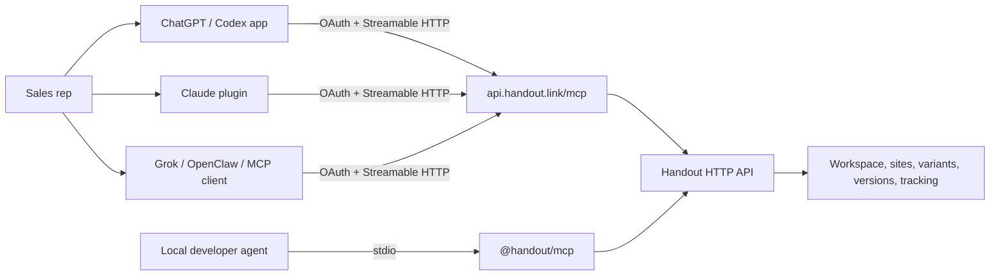

# Handout agent platform

## Product goal

Give a sales rep a trustworthy agent that can turn deal context into an excellent buyer-facing Handout, maintain it throughout the opportunity, produce correct personalized links at scale, and translate engagement into grounded follow-up. The rep should be able to use the same Handout capability from ChatGPT, Codex, Claude, Grok, OpenClaw, or another MCP host without maintaining separate business logic.

The platform has four layers:

1. **Handout API** remains the product and authorization source of truth.
2. **Handout MCP** exposes a stable, JSON-first agent contract over stdio and Streamable HTTP.
3. **Portable skills** teach planning, authoring, personalization, analytics, and safety without depending on one model vendor.
4. **First-class packages** add native discovery and presentation for OpenAI/Codex and Claude.

## Architecture

`packages/mcp/src/server.ts` contains the one canonical MCP definition. `src/index.ts` binds it to stdio. `src/remote.ts` binds it to stateless Streamable HTTP. `apps/api/src/app.ts` hosts the production `/mcp` endpoint beside the product API so tool calls execute through existing services and permissions.

## Agent contract

### Content ownership

Handout SiteContent schema version 3 is the editable source of truth. Each `pages[].document` is a Tiptap/ProseMirror `doc`. Capabilities gives agents the compact block inventory and schema fingerprint. `handout_get_block_schemas` progressively returns the exact canonical node definitions needed for a task: content expressions, structural dependencies, parents and children, attributes, defaults, option references, marks, and schema-valid minimal examples. Editable text belongs in node content; attributes are configuration only. The agent never creates a parallel block/page-builder model.

`handout_edit_site` content mode reads the current SiteContent, applies one typed operation batch, validates the resulting complete document, and writes it with the latest `expectedDraftRevision`. Complete replacement remains available as an explicit operation for intentional rewrites. This makes concurrent edits explicit, avoids accidental field loss, and preserves Tiptap document ownership.

### Tool surface

| Area | Canonical tools | Boundary |
|---|---|---|
| Discovery | `handout_get_capabilities`, `handout_get_block_schemas`, resources | Targeted schema lookup avoids context overload |
| Workspace | `handout_get_workspace_context` | Selective automation detail/activity; no profile or secrets |
| Sites/content | `handout_list_sites`, `handout_get_site`, `handout_create_site`, `handout_duplicate_site`, `handout_edit_site`, `handout_validate_site` | Content writes are atomic and revision-checked |
| Access/publishing/history | `handout_set_site_access`, `handout_publish_site`, `handout_unpublish_site`, `handout_restore_site_version`, `handout_set_site_lifecycle` | Explicit intent for public or destructive effects |
| Personalization | `handout_upsert_variants` | Preview supported; canonical variable keys only |
| Assets | `handout_list_assets`, `handout_import_asset` | Bounded image types; public-HTTPS SSRF controls |
| Tracking | `handout_get_tracking_summary`, `handout_query_tracking` | Summary first; narrow detailed views |
| Automations | `handout_manage_automation` | Open-world tests; signing secrets and payloads withheld |
| Deletion | `handout_delete` | Preview-first, reference-aware, exact-name confirmation |

Every result includes concise task-specific text for model compatibility and sanitized JSON `structuredContent` for reliable downstream use. Internal request IDs, user IDs, credentials, signing secrets, event tokens, retained delivery payloads, binary asset inputs, and storage/encryption fields are recursively removed. Selected list, link, validation, personalization, and analytics results attach the MCP Apps dashboard resource.

### Resources and prompts

The server publishes five model-readable guides, three generated schema/catalog resources, and the optional MCP Apps dashboard resource:

- `handout://guides/operating`
- `handout://guides/content-model`
- `handout://guides/content-patterns`
- `handout://guides/personalization`
- `handout://guides/quality`
- `handout://schema/site-document`
- `handout://catalog/icons`
- `handout://catalog/design-options`

It also exposes reusable prompts for building a sales site, personalizing an account list, and analyzing engagement. Skills remain the deeper workflow layer; prompts are fast entry points for hosts that surface MCP prompts.

## Authentication and workspace selection

The hosted endpoint is an OAuth 2.1 protected resource:

- Resource: `https://api.handout.link/mcp`
- Issuer: `https://api.handout.link`
- Scope: `handout:operate`
- Authorization endpoint: `https://app.handout.link/api/mcp/oauth/authorize`
- Token and dynamic registration endpoints: `https://api.handout.link/api/mcp/oauth/*`
- PKCE: S256 only
- Access token lifetime: 15 minutes
- Refresh token lifetime: 30 days

Authorization reuses the signed-in Handout session and shows a first-party consent screen naming the active workspace. The issued token pins the user ID, active workspace ID, role, plan, issuer, audience, scope, and expiration. Every API call verifies the token, then existing Handout repositories/services continue to enforce workspace permissions. Refresh validates that the user session still exists and the user still belongs to the workspace.

The production implementation also supports an existing static agent token only for controlled server-to-server use and a development bypass only outside production.

## Portable skills

`plugins/handout/skills` follows the Agent Skills folder convention and contains:

- `operate-handout`: canonical workflow, approval boundaries, revision conflicts, content model, safety, and privacy.
- `build-sales-site`: buyer brief, information architecture, Tiptap authoring, validation, and quality scoring.
- `personalize-handout`: variable design, CSV mapping, slug collision handling, batch upserts, and safe fallbacks.
- `analyze-handout-engagement`: summary-first analysis, calibrated inference, and proportionate follow-up.

Templates include a site brief and recipient import CSV. The concise skill entrypoints use progressive disclosure and link to detailed references only when the task needs them.

For agents that do not install plugin packages, `agent/handout-skill/SKILL.md` and `agent/handout-agent-prompt.md` provide a standalone skill and bootstrap prompt. The remote MCP URL is vendor-neutral. The generated catalog is derived from the same ProseMirror schema used for validation and rendering. Targeted lookup keeps routine context small, while the complete catalog supports exhaustive clients and development tooling without maintaining a second handwritten block model.

## OpenAI and ChatGPT packaging

The OpenAI package is rooted at `plugins/handout/.codex-plugin/plugin.json`. It declares the four skills, remote MCP server, brand metadata, privacy policy, and starter prompts. The MCP server includes a standard MCP Apps HTML resource (`text/html;profile=mcp-app`) and OpenAI compatibility metadata for the output template and invocation states.

This follows the official model: a ChatGPT app is an MCP server with optional UI, served using Streamable HTTP, with per-tool annotations and OAuth metadata. References:

- [Apps SDK quickstart](https://developers.openai.com/apps-sdk/quickstart)
- [Build an MCP server](https://developers.openai.com/apps-sdk/build/mcp-server)
- [Apps SDK authentication](https://developers.openai.com/apps-sdk/build/auth)
- [Apps SDK reference](https://developers.openai.com/apps-sdk/reference)
- [App submission](https://developers.openai.com/apps-sdk/deploy/submission)

The repo intentionally does not include a fabricated `.app.json` ID. After the production endpoint is deployed and verified, create the developer-mode ChatGPT app, obtain its real `plugin_asdk_app_...` ID, add `.app.json`, reference it from the Codex plugin manifest, test account linking, and submit through the OpenAI app review flow.

## Claude packaging

The Claude package uses `plugins/handout/.claude-plugin/plugin.json`, the same root `.mcp.json`, and the same skills. Claude discovers component folders from the plugin root and connects to the hosted HTTP MCP server, whose OAuth metadata drives account linking.

References:

- [Create plugins](https://code.claude.com/docs/en/plugins)
- [Plugin reference](https://code.claude.com/docs/en/plugins-reference)
- [Connect Claude Code to tools via MCP](https://code.claude.com/docs/en/mcp)
- [Agent Skills](https://code.claude.com/docs/en/skills)

Developers can test locally with `claude --plugin-dir ./plugins/handout` and validate with `claude plugin validate ./plugins/handout` when the Claude CLI version supports plugin validation.

## Generic MCP clients

Any client supporting remote Streamable HTTP and OAuth can connect directly to `https://api.handout.link/mcp`. Clients without remote OAuth support can run the stdio package with a controlled bearer token or local development auth. The protocol contract is not dependent on ChatGPT component globals or Claude-only commands.

## Experience design

The default agent journey is:

1. Link Handout and choose the current workspace on the consent screen.
2. Tell the agent the opportunity, audience, assets, and desired next step.
3. Receive a private, validated draft and editor link.
4. Review the structure and copy in Handout.
5. Supply recipients or accounts; receive a mapped preview, batch result, and exact share links.
6. Explicitly approve publication.
7. Later ask what happened; receive observed engagement, calibrated interpretation, and follow-up suggestions.

The UI component is intentionally a compact review surface, not a second editor. Handout remains the place for rich visual editing and exact preview. The component shows status, counts, validation, links, and metrics from structured tool results.

## Safety and privacy requirements

- Explicit intent is required for publish, unpublish, team visibility, historical restore, archive, and delete.
- Permanent deletion is never used as cleanup.
- Agents validate before publication and cannot truthfully claim public state before the tool succeeds.
- Share links come from `handout_get_site` public URL projections; agents never construct or guess them.
- Permanent deletion always starts with a reference-aware preview and exact returned-name confirmation.
- Public asset imports are HTTPS-only, block private/special network ranges after DNS resolution and redirects, pin the resolved address, restrict content type, and cap size/dimensions.
- Automation responses never expose signing secrets or retained webhook payloads.
- Tracking starts aggregated; detailed rows are fetched only for a concrete need and with narrow filters.
- Engagement never proves identity, sentiment, budget, or buying intent.
- Recipient imports exclude unused source columns, secrets, sensitive traits, and unverified claims.
- The MCP UI has no external network/resource domains and exposes no request IDs or debugging telemetry.

## Deployment checklist

1. Set `BETTER_AUTH_SECRET`, Handout public origins, and existing production database/session configuration on the API service.
2. Deploy `apps/api`; verify `POST https://api.handout.link/mcp`, protected-resource metadata, authorization-server metadata, registration, PKCE authorization, token refresh, and CORS.
3. Verify the login return path through `https://app.handout.link/api/mcp/oauth/authorize` with signed-in and signed-out users.
4. Run `pnpm --filter @handout/mcp smoke:descriptors` and the live `pnpm --filter @handout/mcp smoke` against a dedicated test workspace. The live harness exercises all 21 tools, revision conflicts, malformed schemas, URL-import SSRF blocks, automation secret withholding, selective tracking, deletion references, exact-name confirmation, and cleanup.
5. Test the MCP Apps component in ChatGPT developer mode and at least one other MCP Apps host.
6. Test `plugins/handout` in Codex and Claude, including skill discovery and OAuth linking.
7. Publish privacy/support documentation and prepare app-review test credentials and reviewer instructions.
8. Create the real OpenAI app registration, add its ID to `.app.json`, and submit only after production proof.

## Verification strategy

Automated tests cover access-token signature/audience/expiry, OAuth client/request/code/PKCE/replay behavior, stored asset validation, private-network image rejection, schema/catalog generation, and site-document validation. Scoped typechecks cover the MCP and API packages. Descriptor smoke verifies the exact 21-tool contract, annotations, OAuth metadata, resources, prompts, and recursive sanitizer. The live abuse harness runs every tool against the real API and verifies concise text, secret-free structured output, conflict/error ergonomics, and cleanup. Release verification must also browser-test the signed-out OAuth redirect, consent screen, editor handoff, published site, personalized links, and analytics recap.
