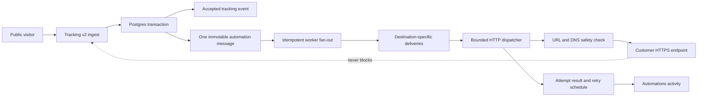

# Webhook Automations Product and Engineering Specification

**Status:** Proposed
**Audience:** Product, design, engineering, security, support, and operations
**Plan:** Pro
**Last reviewed:** 2026-07-21
**Depends on:** `event-tracking-privacy-hardening-spec.md`, `plans-and-billing-implementation.md`, and the current tracking v2 schema/runtime

## 1. Executive Decision

Handout should add a top-level **Automations** feature that lets a workspace admin describe a simple rule:

> When a site is visited, send the details to Zapier.

The product calls these **automations**. It uses **webhook** only when naming the destination URL, explaining advanced verification, or writing developer documentation.

The launch version is intentionally narrow:

- It sends accepted Handout visitor events to a customer-controlled HTTPS endpoint.
- It supports event, site, and recipient filters.
- It sends one stable, versioned payload shape rather than asking non-technical users to design JSON.
- It provides a required test, durable retries, delivery history, manual retry, signed requests, and clear health states.
- It never calls a customer endpoint from the public page, tracking request handler, or database transaction.
- It never lets delivery failure block public rendering, tracking ingestion, the tracking dashboard, or session replay.

The delivery guarantee is **durable at-least-once delivery**. Exactly-once delivery is not technically possible across an HTTP boundary. A stable delivery ID lets a destination safely deduplicate retries.

### 1.1 Current repository facts

- `packages/db/src/schema.ts` already models workspace plans as Free, Core, and Pro and stores accepted tracking v2 events in `tracking_recipient_events`.
- The current triggerable visitor vocabulary is `site_visit`, `button_click`, `link_click`, and `tab_switch`.
- Tracking also models server-side `slack_share` and `webhook_send` events. `apps/api/src/tracking/v2/service.ts` exposes `recordWebhookSend()`, but no product dispatcher currently calls it.
- `plans-and-billing-implementation.md` says Pro is backend-supported and includes replay/API access. The billing UI and plan copy must add Automations and make Pro checkout available before launch.
- The production-shaped stack is Cloudflare Pages for the app, a Cloudflare Worker for public pages, Render for Node compute, Neon Postgres, and R2. No general-purpose queue or automation worker currently exists.
- There are no automation configuration, revision, message, delivery, or usage tables today.

This specification extends the clean tracking-v2 path. It does not add a parallel browser tracker or infer activity from session replay.

## 2. Product Principles

1. **Describe outcomes, not infrastructure.** The primary UI says what happens and where the information goes.
2. **Make the safe path the easy path.** HTTPS, request signing, bounded retries, and a test are defaults, not expert options.
3. **Tracking remains authoritative.** An automation can only react to a validated event that Handout accepted and stored.
4. **Delivery is isolated.** A slow, broken, or malicious destination cannot slow tracking ingestion or public pages.
5. **Failures are visible and recoverable.** The user can see what was sent, why it failed, when it will retry, and how to fix it.
6. **No surprise data movement.** Only admins can configure destinations. Pausing, editing, deleting, downgrading, and usage limiting have explicit behavior.
7. **Bound cost before scaling.** Every queue, request, retry, payload, log, and workspace has a hard upper bound.
8. **No recursive automation.** Delivery activity is operational data, never a triggerable visitor event.

## 3. Scope

### 3.1 Launch scope

- Pro-plan workspace feature
- Workspace-owned automations
- Event triggers:
  - Site visited
  - Button clicked
  - Link clicked
  - Another page opened
  - Any visitor activity
- Filters:
  - Any site or selected sites
  - Optional recipient narrowing
- One HTTPS destination per automation
- Required test before first enable and after the destination or signing key changes
- Stable JSON payload schema v1
- HMAC-SHA256 request signatures using Standard Webhooks-compatible headers
- Durable background delivery, retries, circuit breaking, manual retry, and activity history
- Admin health email when an automation needs attention
- Usage display and bounded Pro-plan limits

### 3.2 Explicit non-goals for launch

- Incoming webhooks
- Scheduled automations
- Multi-step workflows or branching logic
- Custom JavaScript or arbitrary code
- User-designed JSON templates or field mapping
- Native OAuth connections to Salesforce, HubSpot, Slack, or other providers
- Arbitrary request headers or bearer-token authentication
- A customer-facing API or agent action for managing automations
- Strict ordering across retries
- Historical event replay or backfill
- Sending session replay recordings or recorded DOM data
- Sending raw IP addresses, raw user agents, full URLs, query strings, fragments, or hidden site content
- Triggering on internal delivery events, test events, Slack preview fetches, suppressed traffic, or rejected tracking events

Native connectors and payload mapping should be separate future products built on the same delivery engine, not options added to the launch form.

## 4. User Experience

### 4.1 Placement and navigation

Add **Automations** to the primary navigation after Tracking and before Team.

- Route: `/automations`
- Icon: `IconBolt` from `@tabler/icons-react`
- Page title: **Automations**
- Page description: **Send visitor activity to the tools you already use.**

This is a primary product capability, not a workspace settings tab. Billing remains in Settings.

### 4.2 Plan gating

The route remains visible on Free and Core so the feature is discoverable.

Free/Core admin state with no saved automations:

- Title: **Connect Handout to your other tools**
- Description: **Automatically send visits and clicks to Zapier, Make, your CRM, or your own systems.**
- Primary action: **Upgrade to Pro**
- Secondary link: **See what gets sent**

Free/Core non-admin state:

- Same explanation
- No checkout action
- Message: **A workspace admin can upgrade to Pro.**

Pro non-admin state:

- Title: **Automations are managed by workspace admins**
- Description: **Ask a workspace admin if you need an automation created or changed.**
- No configuration or activity data is loaded behind this state.

The API is authoritative. A non-Pro client cannot create, test, enable, or retry an automation by calling the API directly.

Free/Core admins with saved automations see a read-only **Your automations are paused** list instead of losing access to their own configuration. They may view setup/activity and delete an automation; create, edit, test, enable, retry, reveal, and rotate remain Pro-only. This preserves privacy/control after downgrade without allowing data export. The upgrade action remains visible but does not block deletion.

### 4.3 Empty state on Pro

- Title: **Send activity to your other tools**
- Description: **Create a simple rule for what Handout should send and where it should go.**
- Primary action: **Create automation**
- Supporting examples:
  - Tell your team when a recipient opens a site
  - Add important clicks to your CRM
  - Start a workflow in Zapier or Make

Do not lead with JSON, HTTP, signatures, headers, retries, or endpoints.

### 4.4 Automation list

The default list uses a calm table on desktop and stacked rows on mobile.

| Column | User-facing content |
| --- | --- |
| Name | User-chosen automation name |
| When | Plain-language trigger and scope |
| Sends to | Destination service when recognized, otherwise safe hostname only |
| Status | Draft, On, Paused, or Needs attention; a short reason explains plan or usage pauses |
| Last sent | Relative time or Never |

Primary action: **Create automation**

Show one compact usage line above the list: **12,430 of 100,000 delivery attempts used this month** with the local reset date beside it. Every outbound HTTP request counts, including tests and retries. This makes the quota predictable, closes the test endpoint as a free alternate sender, and places a hard ceiling on Handout's outbound-request cost. Do not build a second analytics dashboard.

Row actions:

- View activity
- Edit
- Pause / Turn on
- Delete

Keep test sends on the automation detail/setup surface, where the warning and result remain visible. A list-row test is too easy to fire accidentally and can start a real downstream workflow.

The full destination URL is treated as a secret. List and read APIs return only a safe hostname. They never return the saved path, query values, embedded credentials, or secret header values. An admin who changes the destination pastes a new complete URL.

### 4.5 Create and edit flow

Use one focused three-step dialog on desktop and a full-page flow on narrow screens. Do not introduce a second sheet variant. Use canonical `Field`, `FieldGroup`, `Select`, `Command`, `Badge`, `Alert`, `Button`, `Dialog`, `Skeleton`, and `sonner` primitives with semantic tokens and Tabler icons.

Keep Step 1 in local form state. Create the server draft only when the user continues to the destination/test step, because testing needs an automation ID and encrypted signing key. Give it a trigger-derived name such as **Site visits** immediately, so closing the flow never leaves an unnamed row; Step 3 can refine it once the destination is known. If the user closes afterward, preserve the draft in the list and resume it at the last completed step when reopened. Automatically remove an untested draft after 7 inactive days and any incomplete draft after 30 inactive days; show an expiry note during its final 7 days. Do not create a database row merely because the dialog opened.

#### Step 1: Choose what starts it

Heading: **When should this run?**

Fields:

1. **Activity**
   - A site is visited
   - A button is clicked
   - A link is clicked
   - A visitor opens another page
   - Any visitor activity
2. **Sites**
   - Any current or future site
   - Selected sites (up to 100)

Default to **A site is visited** and **Any current or future site**. Place recipient controls under **Narrow this down** so most users never need them:

- Anyone
- Named recipient links only
- Visitors without a named recipient
- Specific recipients (up to 100)

Specific recipients require selected sites. Recipient choices are limited by those sites. If a selected site or recipient is deleted and nothing remains in scope, pause the automation with a clear **Selection no longer exists** explanation; never broaden it silently.

Place **Any visitor activity** last and explain: **This can send several messages during one visit.** Show a concise usage hint before the user continues.

#### Step 2: Choose where it goes

Heading: **Where should Handout send it?**

Fields:

- **Destination URL** — public HTTPS webhook URL with an example, such as `https://hooks.zapier.com/...`
- **Verify requests** — collapsed signing-key explanation for technical users

Plain-language helper:

> This is the webhook URL your other tool gives you for receiving information. In Zapier or Make, choose a webhook trigger and paste its URL here.

When editing, show **Currently sending to hooks.zapier.com** with **Keep this destination** selected. **Replace destination** reveals an empty URL field. Never put a masked secret into the input or require the admin to repaste an unchanged URL.

The user must select **Send test**. The test runs through the same queue, URL validation, DNS checks, timeout, signing, and HTTP client as a live delivery.

Each test click makes one attempt only. Tests never retry later in the background, because a delayed synthetic message could unexpectedly trigger a workflow after the user has left setup. The user explicitly chooses **Try again** for another test.

Before the first test to a destination, explain once: **This sends sample data and may start the workflow in your other tool.** Tests from an existing automation require a confirmation with the same warning.

Test states:

- Waiting: **Sending a test…**
- Success: **Test accepted by hooks.zapier.com**
- Timeout: **The destination did not respond within 5 seconds. Check the URL and try again.**
- Redirect: **This URL redirects somewhere else. Paste the final destination URL instead.**
- 401/403: **The destination did not accept the test. Check the URL or destination settings.**
- 404: **Nothing is receiving requests at this URL. Check the URL and try again.**
- 429: **The destination is limiting requests. Wait a moment and try again.**
- 5xx: **The destination is having a problem. Try again in a moment.**
- Unsafe URL: **This URL cannot be used. Enter a public HTTPS webhook URL.**

A successful test remains valid for that exact saved destination and signing-key revision. It does not expire merely because the user took longer to finish setup. Changing either value invalidates it. The test endpoint returns `202` with a delivery ID; the client polls the bounded delivery-status endpoint until success, failure, or a 15-second UI timeout. Closing the UI does not cancel the test.

#### Step 3: Review and turn on

Heading: **Review your automation**

The signature interaction is a live sentence assembled from the user's choices:

> When anyone visits Acme proposal, send the details to Zapier.

Show:

- The live sentence
- The data categories being sent
- Destination hostname
- Last test result and time
- Automation name, suggested as a short label such as **Acme proposal visits → Zapier** and editable

Primary action: **Turn on automation**

Success toast: **Automation turned on.**

### 4.6 Verify requests

This section is collapsed by default. It exists for a developer configuring the receiving endpoint; it is not part of the primary setup explanation.

Every automation receives its own 32-byte signing key, serialized as base64 with the `whsec_` prefix.

- The key is hidden by default and returned only through an explicit **Reveal signing key** action after recent reauthentication. It is never included in normal automation reads.
- The reveal view has a Copy action and closes back to a masked state. Verification instructions are a separate downloadable code example so the secret is never embedded in documentation.
- The UI calls it **Signing key** and explains: **Your destination can use this to confirm messages came from Handout.**
- Admins may rotate it after a confirmation.
- Rotation supports a 24-hour overlap in which current and previous signatures are both sent.
- The previous key is destroyed after the overlap.

Rotation is one guided action: create and reveal a candidate key, let the admin update the receiver, send a test signed with the candidate key only, then promote it. Promotion starts the 24-hour live overlap and shows its exact end time. Cancelling destroys the candidate without changing live delivery. The UI reveals only the candidate/current key, never the previous one. A 2xx test proves the destination accepted the request; Handout cannot prove that a receiver actually verified the signature, so the copy must not claim otherwise.

### 4.7 Automation details

Selecting an automation opens the dedicated route `/automations/:automationId`. It has two tabs:

#### Setup

- Live rule sentence
- Status and status explanation
- Trigger and filters
- Safe destination display
- Signing-key controls
- Pause, edit, test, and delete actions

Delete confirmation names the automation and says: **New and waiting events will not be sent. A request already being sent may still finish. This cannot be undone.**

#### Activity

Filters: All, Sent, Retrying, Failed, Tests.

Each row shows:

- Time
- Human-readable event, site, and recipient
- Status
- Attempts
- Destination hostname

Selecting a delivery opens details:

- A plain-language **Sent data** summary
- **View JSON** as a secondary technical disclosure
- Delivery ID
- Event ID
- Attempt timeline
- HTTP status or typed failure reason
- Next retry time when applicable
- **Retry now** for admins on failed live deliveries

Manual retry requires confirmation: **This sends the same event again and may run the destination workflow again.** The stable delivery ID is shown so a technical receiver can deduplicate it.

Exact sent JSON and manual retry are available for 7 days. After that, the activity row and safe summary remain for 30 days, labeled **Sent data no longer retained**. Do not store or display arbitrary response bodies in v1. They can contain secrets or personal data. Show status code, duration, and a safe error category instead.

### 4.8 Status language

| Stored state / block | UI label | Explanation |
| --- | --- | --- |
| `draft` | Draft | Setup has not been completed. |
| `enabled` | On | New matching activity will be sent. |
| `paused` | Paused | Nothing will be sent until this is turned on. |
| `needs_attention` | Needs attention | This automation stopped because something needs fixing. Its reason explains the next step. |
| Effective plan is not Pro | Paused | Upgrade to Pro to use this automation. |
| `enabled` + current `usage_blocked_month` | Paused | The workspace reached its monthly delivery limit. Tracking continues normally. |

Status must never be communicated by color alone. Every asynchronous state change uses an accessible announcement.

Lifecycle transitions are explicit:

- Draft -> On only after a successful test, Pro entitlement, and admin action.
- On -> Paused immediately makes non-started work ineligible and does not backfill the paused interval.
- On -> Needs attention is system-controlled after the circuit-breaker threshold.
- Needs attention -> On requires a new successful test and admin action.
- When the effective plan leaves Pro, plan gating takes precedence in the UI and worker eligibility. An On automation also becomes Paused so a later upgrade can never restart data export automatically. Draft and Needs attention retain their underlying state.
- When Pro access returns, no lifecycle state changes automatically. Previously On automations are Paused; drafts remain Draft; Needs attention remains Needs attention.
- At the monthly limit, an On automation keeps its underlying state and records the current `usage_blocked_month`. At the next UTC month, clear only that usage block and create a fresh revision boundary. It returns to On without backfill unless an admin paused/deleted it or a plan/health condition now applies.
- Deletion sets `deleted_at`, retires the current revision, and is irreversible in product UI; it is not a second status value.

Persist only `draft`, `enabled`, `paused`, and `needs_attention` as lifecycle states. Derive the plan gate from the authoritative workspace entitlement; persist only the month-scoped usage block. This avoids representing two simultaneous blockers in one field and keeps drafts, explicit user intent, health, and commercial eligibility from overwriting one another.

### 4.9 Permissions

- Automations are admin-only in v1 because they export workspace tracking data and expose operational destination details.
- Workspace admins can view, create, edit, test, enable, pause, rotate signing keys, retry, and delete.
- Regular members may see the Automations navigation item and a short **Only workspace admins can view and manage automations** state. They cannot list configurations or delivery activity.
- The internal app API enforces admin role and workspace ownership on every route. A customer-facing API or agent management surface is deferred until its own permission model is designed.

## 5. Event Semantics

### 5.1 Triggerable visitor events

The automation registry is an explicit allowlist.

| Stored event type | UI label | Meaning |
| --- | --- | --- |
| `site_visit` | Site visited | One accepted tracking session started. A reload or new browser tab can start another session. |
| `button_click` | Button clicked | A modeled Handout button or linked image was activated. |
| `link_click` | Link clicked | A modeled sidebar link was activated. |
| `tab_switch` | Another page opened | A visitor intentionally opened another Handout page/tab. It is not a browser pageview. |

Only events that passed signed-context validation, manifest resolution, suppression rules, rate limits, and idempotency checks are eligible.

### 5.2 Never triggerable

- `slack_share` / Slack preview signals
- The existing internal `webhook_send` tracking event
- Delivery attempts or successes
- Test deliveries
- Rejected, suppressed, or duplicate browser events
- Session heartbeats
- Session replay chunks
- Tracking setting changes
- Product analytics events

The current `webhook_send` event is operational delivery metadata that was modeled ahead of the product integration. Do not call `trackingV2Service.recordWebhookSend()` from the new dispatcher. New delivery activity belongs in automation delivery tables and the Automations activity UI. Keep the old enum value temporarily for database compatibility, hide it from new trigger choices, and remove or migrate it in a separate compatibility-safe cleanup.

This boundary makes feedback loops structurally impossible.

### 5.3 Tracking and privacy interaction

- If tracking is off, no visitor event exists and no automation runs.
- If a visitor declines or withdraws from the applicable tracking flow, no later event is exported.
- Internal-network suppression and other configured suppression rules also suppress automations.
- Automations never receive replay content.
- Customer-configured exports remain a separate customer-directed processing purpose as already defined by the tracking privacy specification. Terms, privacy documentation, and the subprocessor/data-processing workflow must disclose this feature before production launch.

## 6. Payload Contract

### 6.1 Stable envelope

All live deliveries use `POST` with `Content-Type: application/json; charset=utf-8`. The expected body is under 4 KiB and the hard maximum is 16 KiB.

```json
{
  "schema_version": 1,
  "test": false,
  "event": {
    "id": "evt_01...",
    "type": "site_visit",
    "occurred_at": "2026-07-21T15:04:05.123Z"
  },
  "workspace": {
    "id": "...",
    "name": "Acme"
  },
  "site": {
    "id": "...",
    "name": "Acme proposal",
    "slug": "acme-proposal"
  },
  "recipient": {
    "id": "...",
    "name": "Jamie Chen",
    "company": "Northstar"
  },
  "session": {
    "id": "...",
    "started_at": "2026-07-21T15:04:05.123Z",
    "device": {
      "type": "desktop",
      "os": "macOS",
      "browser": "Chrome"
    },
    "location": {
      "city": "New York",
      "region": "New York",
      "country_code": "US"
    }
  },
  "page": {
    "id": "...",
    "label": "Overview",
    "previous_id": null,
    "previous_label": null
  },
  "element": null
}
```

Rules:

- The body is immutable across retries.
- `session.id` is the existing opaque public session ID, never the internal database row ID or event token.
- Workspace, site, recipient, session, page, and element values are snapshotted when the immutable message is created; later edits do not rewrite an already queued payload.
- Not-applicable optional objects are `null`; fields do not silently disappear.
- `recipient` is `null` for a general public link.
- Page and element labels come from the same immutable tracking manifest that validated the stored event. Workspace, site, and recipient display fields are snapshotted from the authorized rows used while accepting it; later edits cannot change the message.
- Destination data includes only the existing safe destination category and hostname; never full URL/path/query/fragment.
- Location is coarse and nullable.
- No raw IP, IP hash, raw user-agent string, browser path, referrer, variable map, hidden content, replay data, or secret is included.
- Schema v1 changes are additive only. A breaking change requires an opt-in version and migration period.

Event-specific fields are fixed:

| Event type | `page` | `element` |
| --- | --- | --- |
| `site_visit` | Initial page; previous fields are null | null |
| `button_click` | Page containing the modeled control | `{ id, label, kind, destination: { kind, host } }` |
| `link_click` | Page containing the modeled sidebar link | `{ id, label, kind, destination: { kind, host } }` |
| `tab_switch` | Newly opened page plus previous page ID/label | null |

Click events use this exact nested shape:

```json
{
  "element": {
    "id": "...",
    "label": "Book a call",
    "kind": "button",
    "destination": {
      "kind": "calendar",
      "host": "cal.com"
    }
  }
}
```

`destination.host` is nullable and never includes a port, path, query, fragment, or credentials. The JSON schema published to customers must be generated from the same contract used to validate stored message bodies; documentation examples cannot be maintained by hand as a second contract.

Test deliveries use the selected event type with synthetic values and `test: true`. The review screen warns that a test may cause the receiving tool to run a test workflow.

### 6.2 Request headers and signing

Use Standard Webhooks-compatible headers:

- `Webhook-Id`: stable delivery ID, unchanged across retries
- `Webhook-Timestamp`: Unix seconds for the current attempt
- `Webhook-Signature`: one or more `v1,<base64>` HMAC-SHA256 signatures
- `Idempotency-Key`: same stable delivery ID
- `X-Handout-Event`: event type
- `X-Handout-Automation-Id`: stable automation ID, useful when one receiver serves several automations
- `X-Handout-Attempt`: one-based attempt number
- `User-Agent`: versioned Handout webhook sender

Sign the exact UTF-8 body using the Standard Webhooks construction based on webhook ID, timestamp, and raw body. Each automation has a unique signing key; keys are never shared across workspaces or endpoints.

Verification examples must compare signatures in constant time, reject timestamps outside a documented five-minute tolerance, and deduplicate `Webhook-Id`. These are receiver recommendations, not claims Handout can enforce after delivery.

## 7. System Architecture



### 7.1 Transactional message outbox

`webhook_messages` is the transactional outbox and immutable payload store. It prevents a batch of events matching many automations from multiplying writes on the tracking hot path.

When tracking inserts accepted triggerable events, the same database transaction performs one bounded bulk operation that:

1. Finds enabled current automation revisions for the event workspace.
2. Confirms the workspace is currently Pro.
3. Applies event, site, and recipient filters.
4. Creates at most one immutable message per accepted source event, containing the exact canonical UTF-8 JSON body, its SHA-256 checksum, and the bounded set of matching revision IDs.

The worker later expands a message into destination-specific delivery rows in an idempotent fan-out transaction. The unique key `(automation_id, message_id)` prevents duplicate delivery creation if fan-out is retried. The captured revision IDs preserve the rule that matched at event time; a pause, delete, plan lock, usage limit, or retired revision can still cancel dispatch before fan-out.

Before inserting messages, the same transaction performs one atomic workspace queue-admission update for the whole accepted event batch. It reserves only enough pending-message slots to stay below the hard ceiling. Overflow events still commit to tracking but do not create automation messages; an aggregate suppression count and a high-severity operational alert make the loss explicit. This is the only automation counter touched on tracking ingestion and is necessary to keep a worker outage from growing the message outbox without bound.

No monthly-usage lock, DNS lookup, secret decryption, user-supplied JSON transformation, or outbound network call happens in the tracking transaction. The no-automation path is one indexed lookup and no inserts. Payload construction uses bounded, already-authorized context loaded once per request/batch, not a new set of joins per event.

Place the automation lookup/admission/message insert behind a database savepoint after accepted tracking rows are inserted. Under normal operation, event and message commit atomically. If an automation-only constraint, payload invariant, or counter operation fails, roll back to that savepoint, commit tracking, suppress export without backfill, and emit a high-severity typed metric/log. A failure of the outer database transaction still rolls back both. This narrow fail-open boundary prevents an automation implementation defect from becoming a tracking outage without pretending the missed export was delivered.

Give the queue-admission lock a strict 25 ms budget. If it cannot be acquired, take the same typed suppression path instead of stalling tracking behind a hot workspace counter. Load tests must include concurrent batches for one high-volume workspace; do not add sharded counters unless measurement shows this single batched update cannot meet the ingestion budget.

All browser event insertion paths must use one shared triggerable-event writer so `site_visit` and batch events cannot drift. Server events such as Slack preview and webhook delivery activity bypass this writer by type.

### 7.2 Fan-out and dispatcher

Run a dedicated, fixed-size Render worker process from the API package. This gives retry timers an always-on owner and isolates outbound sockets and failure modes from the API process.

The worker has two independently observable loops: message fan-out and HTTP dispatch. Fan-out claims messages, filters any revision that is no longer dispatchable, atomically reserves monthly capacity, inserts delivery rows, and marks the message complete in one transaction. A crash can repeat the transaction safely.

Worker rules:

- Claim small batches with `FOR UPDATE SKIP LOCKED`.
- Commit the lease before making any network request.
- Never hold a database transaction open during HTTP.
- After leasing and before decrypting/sending, re-check that the automation and captured revision are still dispatchable. Otherwise cancel the row without a request. Once request transmission starts it is in flight and cannot be recalled.
- Use a two-minute lease with expired-lease recovery.
- Stop claiming work on `SIGTERM`, finish bounded in-flight work, and release/expire remaining leases safely.
- Global concurrency: 20.
- Workspace concurrency: 5.
- Automation concurrency: 2.
- Claim work fairly across workspaces so one high-volume tenant cannot starve everyone else; claim at most five rows from one workspace in a scheduling pass.
- Smooth sends to 5 requests/second per automation and 20 requests/second per workspace rather than dropping normal bursts.
- Database pool maximum: 2 for the worker initially.
- Poll adaptively: claim continuously while work exists, then back off to a maximum five-second idle interval. This reduces empty-query load but deliberately favors the first-attempt SLO over database scale-to-zero.

Fan-out locks workspace and automation counter rows in stable ID order. It creates only the deliveries that fit both queue ceilings, reserves monthly usage only for those rows, records aggregate suppressions for the rest, completes the message, and decrements the pending-message count in the same transaction. A delivery decrements pending-delivery counters exactly once when it becomes succeeded, failed, or cancelled. Database checks prevent negative counters; a low-frequency reconciler verifies derived counts and alerts operators rather than silently repairing drift.

The dedicated worker and a small always-active Neon compute are deliberate fixed monthly costs and must not be deployed before Pro checkout is available. Frequent worker polling can prevent Neon scale-to-zero; do not present this design as pay-per-use infrastructure. Budget and alert on both baselines explicitly. Do not use open-ended autoscaling for v1. Adding Redis, Render Key Value, or Cloudflare Queues at launch would introduce another durable system plus an unavoidable database/queue handoff without removing the Postgres outbox. If measured volume later justifies a managed queue, keep Postgres as the source of truth and add a separately retryable outbox publisher; never dual-write in the tracking transaction.

### 7.3 HTTP behavior

- Method: `POST`
- Production scheme: HTTPS only
- TLS certificate validation: always on
- Connect timeout: 2 seconds
- Total request timeout: 5 seconds
- Redirects: disabled
- Request body: maximum 16 KiB
- Request header `Accept-Encoding: identity`; responses are not decompressed
- Response body: not persisted; read/discard at most 8 KiB and then close the response
- Success: receipt of any 2xx response headers; abort/discard the bounded body without requiring it to finish
- Retryable: DNS/network errors, timeout, 408, 425, 429, and 5xx
- Terminal: other 4xx responses and security-policy failures
- `Retry-After`: honored for 429/503 only, bounded to the remaining retry window

### 7.4 Retry policy

Live deliveries use a maximum of seven automatic attempts; tests use one attempt:

1. Immediately
2. 1 minute
3. 5 minutes
4. 30 minutes
5. 2 hours
6. 8 hours
7. 24 hours

Apply +/-20% jitter to scheduled retries. The final automatic attempt occurs roughly 34.5 hours after the event. After automatic retries end, an admin may request at most three manual retries while the payload is still retained. Manual retries keep the same delivery ID, do not restart the automatic schedule, and are separately rate limited.

Deliveries can arrive out of order when an earlier request is retrying. The payload timestamp and stable delivery ID are authoritative.

## 8. Persistence Model

Names may use the `webhook_` prefix in the database while the product remains Automations.

### 8.1 Tables

#### `webhook_automations`

- `id`
- `workspace_id`
- `name`
- `state` — draft, enabled, paused, or needs_attention
- `usage_blocked_month` — nullable UTC month; plan gating is derived from workspace entitlement
- `current_revision_id`
- `draft_revision_id`, nullable
- `created_by_user_id`
- `updated_by_user_id`
- `state_changed_by_user_id`, nullable for system transitions
- `state_changed_at`
- `state_reason` — nullable controlled reason such as manual, delivery_failures, unsafe_destination, authorization_rejected, or selection_missing
- `enabled_at`
- `last_success_at`
- `last_failure_at`
- `consecutive_failures`
- `circuit_open_until`
- `attention_notified_at`
- `notification_attempt_count`, `notification_next_attempt_at`
- `pending_delivery_count`
- `created_at`, `updated_at`, `deleted_at`

Indexes: `(workspace_id, state, usage_blocked_month)`, `(workspace_id, updated_at)`.

#### `webhook_automation_revisions`

Immutable configuration snapshot:

- `id`
- `automation_id`
- `revision_number`
- `event_types` — non-empty enum array, maximum 4
- `site_scope` — all or selected
- `site_ids` — UUID array, maximum 100 and empty unless selected
- `recipient_scope` — anyone, named, unnamed, or selected
- `recipient_ids` — UUID array, maximum 100 and empty unless selected
- `endpoint_ciphertext`
- `endpoint_host`
- `signing_secret_ciphertext`
- `previous_signing_secret_ciphertext` and expiry during rotation only
- `encryption_key_version`
- `tested_at`
- `tested_delivery_id`
- `created_by_user_id`
- `created_at`, `activated_at`, `retired_at`

Use checked Postgres arrays rather than separate selection tables at launch. With at most 20 active automations and 100 selected IDs per dimension, the tracking transaction can load the workspace's current revisions once, match the accepted event batch in memory, and bulk-insert messages. Do not add GIN indexes or join tables without measured need. Do not duplicate mutable site/recipient labels into configuration.

#### `webhook_messages`

One immutable payload per accepted source event that matched at least one active revision:

- `id`
- `workspace_id`
- `source_event_row_id`, nullable after event retention
- `source_event_id`
- `kind` — live or test
- `schema_version`
- `payload_body` — exact canonical/minified UTF-8 JSON text, nullable after payload retention
- `payload_sha256`
- `payload_redacted_at`, nullable
- `display_summary` — bounded safe fields needed for the human activity row after payload redaction
- `matched_revision_ids` — bounded to the workspace active-automation limit
- `fanout_summary` — bounded counts only: created, ineligible, usage_suppressed, and queue_suppressed
- `fanout_status` — pending, complete, or cancelled
- `lease_owner`, `leased_at`, `lease_expires_at`
- `created_at`, `fanout_completed_at`, `expires_at`

Unique: `source_event_id` for live messages. Test messages use a separate test idempotency key. Queue index: `(fanout_status, created_at)`.

#### `webhook_deliveries`

- `id` — stable delivery ID
- `workspace_id`
- `automation_id`
- `automation_revision_id`
- `message_id`
- `kind` — live or test
- `status` — pending, succeeded, failed, or cancelled
- `attempt_count`
- `manual_attempt_count`
- `attempts` — bounded JSON array of safe attempt summaries, maximum 10
- `next_attempt_at`
- `lease_owner`, `leased_at`, `lease_expires_at`
- `first_attempt_at`
- `succeeded_at`
- `failed_at`
- `last_http_status`
- `last_error_code`
- `last_duration_ms`
- `expires_at`
- `created_at`, `updated_at`

Unique: `(automation_id, message_id)`.

Queue index: `(status, next_attempt_at, created_at)` for pending/retry work.

Each attempt entry contains only attempt number, automatic/manual source, start/end time, outcome, HTTP status, duration, and safe error code. No request secrets, full destination URL, response body, or raw provider error is stored. One lease owner can append to a delivery, and database checks cap the array and counters; a separate attempt table is unnecessary at launch.

Do not persist a competing `in_flight` status: a valid lease on a pending row is the in-flight fact. A retryable failure with attempts remaining stays pending with a future `next_attempt_at`; success becomes succeeded; terminal/exhausted failure becomes failed; policy/lifecycle suppression becomes cancelled. Manual retry may move failed back to pending only when the payload, attempt limit, rate limit, automation eligibility, and expected row version all remain valid.

#### `webhook_workspace_queue_state`

- `workspace_id` — primary key
- `pending_message_count`
- `pending_delivery_count`
- `suppressed_message_count`
- `suppressed_delivery_count`
- `suppression_started_at`, `last_suppressed_at`, `suppression_resolved_at`
- `admin_notified_at`
- `notification_attempt_count`, `notification_next_attempt_at`
- `updated_at`

This is queue admission, not analytics. Tracking increments pending messages once per accepted batch; fan-out decrements them and increments/decrements pending deliveries in the same transactions that change the underlying rows. Database checks require non-negative values; conditional atomic updates enforce configured ceilings. Per-automation pending delivery count lives on the automation row. The counters exist to bound storage under worker outage without repeated `COUNT(*)` scans or a read-then-insert race. A new suppression incident resets its aggregate counts; it resolves after both queues stay below 50% for five minutes. Operator metrics retain longer trends without turning this row into event history.

#### `webhook_usage_monthly`

- `workspace_id`
- `month_utc`
- `delivery_attempts`
- `usage_suppressed_count`
- `warning_notified_at`
- `notification_attempt_count`, `notification_next_attempt_at`

Primary key: `(workspace_id, month_utc)`. A worker atomically reserves one unit immediately before each outbound request. This prevents concurrent workers from crossing the monthly hard limit and bounds actual outbound work, including retry storms and tests, without adding a counter lock to tracking ingestion. Success/failure rates belong in operational metrics; v1 does not need a second daily usage table.

Immutable revisions record who changed configuration and when. Automation state-change fields record the latest lifecycle actor/reason, delivery rows record tests and retries, and deletion is soft during retention. Do not add a webhook-specific audit-log table until Handout has a general workspace audit-log contract.

### 8.2 Configuration revision behavior

- Renaming does not cancel queued work.
- Changing trigger filters, destination, or signing keys creates a new immutable draft revision. An enabled automation continues using its current revision while the draft is edited and tested.
- A filter-only draft inherits the current revision's successful destination test. Changing the destination or signing key clears that proof and requires a new test.
- Once the draft has a valid test proof, saving atomically promotes it to current, retires the previous revision, and clears `draft_revision_id`.
- Cancelling edit destroys the draft revision and any draft-only secrets without changing live behavior.
- An unchanged destination is represented explicitly in the mutation contract; the saved URL is never sent back to the browser just to prefill a form. The server decrypts/re-encrypts it under the new revision's associated data when promotion requires it.
- Pausing, deleting, or promoting any new trigger/destination/signing revision atomically retires the previous revision. That makes every non-started row for it non-dispatchable immediately; a bounded background cleanup changes those rows to cancelled without making the user mutation update thousands of deliveries.
- Whenever sending stops because of Pause, Needs attention, lost Pro eligibility, a usage block, or Delete, the current revision becomes non-dispatchable. Pending messages that captured it are skipped even if processed later.
- Resuming creates or promotes a new current revision, even when configuration is unchanged. This clean revision boundary is what prevents paused or limited intervals from being backfilled. A manual pause/resume may reuse the last successful test; Needs attention and a plan-caused pause require a new test; automatic usage reset may reuse it only when configuration is unchanged.
- An in-flight request cannot be recalled; its result remains visible.
- Paused intervals are never backfilled.
- Enabling after a plan upgrade requires a new successful test and explicit admin action.

`current_revision_id` means the configuration currently shown, even while Paused; that revision may already be retired from dispatch. `draft_revision_id` is the only editable candidate. On resume, clone/promote a fresh immutable revision and replace `current_revision_id`. Do not also maintain a revision-status enum that can drift from these pointers. `activated_at` and `retired_at` are immutable dispatch-history timestamps, not competing state.

### 8.3 Retention and deletion

- Exact message payload body: 7 days, then redacted
- Safe message summary and delivery history: 30 days
- Bounded attempt summaries: stored with the 30-day delivery row
- Usage aggregates: 13 months
- Deleted automation configuration: cancel pending work and cryptographically erase endpoint/signing ciphertext as soon as no in-flight delivery needs it
- Workspace deletion: cascade all automation data and secrets
- Verified privacy erasure: immediately redact matching payload bodies and human summaries, then retain only non-identifying operational counts required for abuse, billing, or legal obligations

A bounded external retention command should clean these tables alongside, but operationally separate from, tracking replay cleanup.

Revisions referenced by a retained message or delivery cannot be hard-deleted. The cleanup order is payload redaction, delivery/message expiry, then unreferenced retired-revision cleanup. Delivery foreign keys enforce the fanned-out case; the cleanup query must also prove that no unexpired pending message contains the revision ID before deletion. Retention integration tests enforce both paths.

## 9. Entitlements and Cost Controls

Centralize plan capabilities in one server-owned entitlement module. Do not scatter `plan === "pro"` checks through routes, React components, and workers.

Recommended launch defaults per Pro workspace:

| Limit | Default |
| --- | ---: |
| Active automations | 20 |
| Total non-deleted automations, including drafts | 50 |
| Outbound delivery attempts per calendar month | 100,000 |
| Pending messages before fan-out | 10,000 per workspace |
| Pending/retrying deliveries | 10,000 workspace / 2,000 automation |
| Attempts per delivery | 7 automatic + 3 manual |
| Payload size | 16 KiB hard maximum; under 4 KiB expected |
| Tests | 10/automation/hour and 50/workspace/hour |
| Request duration | 5 seconds |
| Activity retention | 30 days |

A **delivery attempt** is one outbound HTTP request, whether it is the first live send, a test, an automatic retry, or a manual retry. If one event matches three automations, the first sends use three attempts. A queue-suppressed match and a delivery cancelled before an HTTP request use no attempts. Test-rate, per-delivery retry, queue, and monthly attempt ceilings all apply; together they prevent a broken destination, retry storm, or test action from creating unbounded outbound work.

At 80% monthly usage:

- Show an in-product usage warning.
- Alert operators through the normal service-monitoring channel. Admin email is intentionally deferred until Handout has one shared, durable notification-intent system; the webhook worker must not receive broad email credentials or grow a second ad hoc notification queue.

Usage months begin at 00:00 UTC on the first day of the month. The UI renders the next reset in the user's locale and also makes the UTC boundary available in help text.

At 100%:

- Do not start another outbound request. Existing queued deliveries remain visible but cannot send until the automation is explicitly resumed after reset.
- Keep tracking ingestion and the tracking UI fully operational.
- Set `usage_blocked_month` on affected On automations and retire their current revisions.
- Show the exact reset date.
- Do not create an overage bill in v1.

The worker locks the workspace-month counter and reserves capacity immediately before starting the request. Concurrent workers may reach that lock in different order, so the product makes no oldest-first promise at the exact boundary; it guarantees that the cap is never exceeded. Reaching the boundary moves affected automations to Needs attention and prevents pending rows from dispatching. A new month removes the quota condition, but an admin must explicitly turn the automation back on; the existing test remains valid because the destination did not fail or change. Paused intervals are never backfilled.

Month reset is lazy and idempotent, not dependent on a midnight cron succeeding. The first ingestion, list read, or worker eligibility check that observes an older `usage_blocked_month` takes the workspace lock, confirms current plan/state, clones fresh revisions for still-enabled automations, and clears that month. A scheduled sweep is only a safety net. This prevents an expired usage block from leaving automations stuck after UTC month rollover.

These values are configuration, not constants embedded in UI. Active/total automation creation and monthly delivery reservation must be concurrency-safe, using a workspace-scoped lock or atomic counter rather than a read-then-write count. Validate the defaults with load tests and observed unit cost before marketing them. Pro pricing must cover one fixed worker instance plus worst-case bounded retries.

Storage must be measured against the limit before launch. At the expected sub-4-KiB body size, 100,000 one-to-one messages are under roughly 400 MiB of raw payload before seven-day redaction; the 16-KiB hard ceiling would be about 1.6 GiB and should be an invariant-alert scenario, not normal operation. A source event that matches multiple automations stores its body once. Load tests must measure actual Postgres bytes for messages, deliveries, indexes, and bounded attempt arrays, then lower the quota or body ceiling if the fixed database budget cannot absorb the measured worst case.

Also measure database write amplification and WAL from repeatedly appending the bounded attempt array; raw retained bytes alone understate cost. At the 5-second timeout, concurrency 20 can start only about four fully slow requests per second. Capacity planning and invited-workspace count must use that failure-case throughput, not the healthy 20 requests/second rate. Start with one worker replica, alert at sustained 50% socket/concurrency utilization, and add a second fixed replica only after validating lease fairness and database capacity; never reactively autoscale an outage into a retry storm.

Queue admission is fail-open for tracking and fail-closed for export: once either queue ceiling is reached, tracking events continue but excess automation messages/deliveries are suppressed without backfill. Do not create one suppression row per dropped match, which would defeat the bound. Show admins a workspace-level incident banner with the aggregate count/time window and alert operators. When capacity returns, still-enabled revisions handle only new events. A platform-wide queue incident requires status communication; it must not masquerade as a customer destination error or force every admin to re-enable healthy automations.

Admin emails are notification intents, not a reason to give the delivery worker the Resend key. The worker calls one narrowly authenticated internal API route with a typed resource ID/reason; the API loads authoritative admins/content and uses the existing transactional-email service with a deterministic episode idempotency key. The worker persists retry timing on the owning automation, usage, or queue-state row and marks notification complete only after the internal API succeeds. Use the same bounded seven-attempt/24-hour notification retry schedule; after exhaustion, keep the in-product state and alert operators. The route accepts no arbitrary recipients, subject, or body and is rate limited. Render background workers can make outbound requests even though they expose no inbound address.

### 9.1 Failure circuit breaker

To prevent a dead endpoint from generating unlimited retries:

- After 10 consecutive failed attempts across live deliveries, stop new claims for that automation for 15 minutes while existing work remains queued.
- A later success closes the circuit and resets the counter.
- After 50 consecutive failed attempts or 24 hours without a success while failures continue, set `needs_attention`, cancel non-started pending deliveries, stop enqueueing new ones, and email admins once.
- An unsafe-destination result moves directly to `needs_attention`. Three consecutive terminal configuration responses such as 401, 403, or 404 do the same; retrying more events cannot repair them.
- A successful test is required before the admin can resume.
- Queue ceilings take precedence for export; their aggregate suppression path is defined above.

This is an explicit product state, not an invisible worker optimization.

### 9.2 Plan changes

- Stripe remains the source of truth for the effective workspace plan.
- When the effective plan leaves Pro, atomically move On automations to Paused and retire their current revisions. The effective-plan check also takes precedence in worker eligibility, so every queued row becomes non-dispatchable even if the lifecycle update is retried. Cancel queued rows in bounded background batches rather than making the Stripe webhook update up to 10,000 deliveries.
- Preserve configuration while the workspace exists, but make no outbound calls.
- Returning to Pro removes the entitlement gate but never changes an automation to On. Previously On automations are Paused and require a new test plus explicit re-enable; drafts and Needs attention retain their underlying state.
- A cancellation scheduled for period end does not lock automations until the effective plan actually changes.

## 10. Security

### 10.1 SSRF and destination safety

Customer-controlled webhook URLs are an SSRF boundary. Creation-time validation alone is insufficient.

At test time and every live attempt:

1. Parse with one strict WHATWG URL path.
2. Require HTTPS in production.
3. Require a DNS hostname and the default HTTPS port 443; reject IP-literal destinations and other explicit ports in v1.
4. Reject embedded usernames/passwords, fragments, invalid IDNA, hosts over 253 characters, and URLs over 2,048 characters.
5. Reject localhost, `.local`, private, loopback, link-local, multicast, unspecified, documentation, benchmark, reserved, and cloud-metadata ranges for IPv4 and IPv6.
6. Resolve every A and AAAA record through the approved resolver and follow the result to the final address set.
7. Reject the hostname if any answer is unsafe.
8. Pin the validated address for that connection while preserving the original hostname for TLS SNI and certificate validation.
9. Disable redirects. Never forward headers to another origin.
10. Re-resolve and revalidate on every attempt to prevent DNS rebinding.

Use one shared safe HTTP client for tests and live delivery. Cover alternative numeric IP encodings, IPv4-mapped IPv6, trailing dots, IDNA, CNAME chains, multiple answers, DNS rebinding, and redirect-to-private-host cases in tests. Add network-layer egress restrictions when the hosting platform supports them; application validation is not the only defense. OWASP's SSRF guidance specifically calls out custom webhooks, full A/AAAA validation, private/link-local rejection, DNS pinning risk, and disabled redirects.

The worker receives only the credentials it needs: its small Postgres pool, versioned webhook-encryption keys, and a scoped token that can invoke only the fixed internal automation-notification route. It must not receive Stripe, Resend, replay-storage, Better Auth, logo provider, or tracking-context signing secrets. This limits the blast radius of both SSRF and process compromise.

Local tests should inject a fake transport. If manual localhost delivery is necessary, it requires an explicit development-only flag that startup validation rejects when `NODE_ENV=production`; do not scatter environment exceptions through URL-validation code.

### 10.2 Secret storage

- Encrypt endpoint URLs and signing keys with AES-256-GCM and a random nonce.
- Bind associated data to workspace, automation, revision, and field identity.
- Keep versioned master keys in Render secret configuration initially; support online rotation.
- Prefer a managed KMS/envelope-encryption service when operational maturity justifies it.
- Never log plaintext URLs beyond safe hostname, payload bodies, signing keys, or decrypted database fields.
- Never return saved secrets in list/detail/mutation responses. The signing key is the one exception: an admin may explicitly reveal it through the reauthenticated, rate-limited secret endpoint. The destination URL is never revealable.

### 10.3 Authentication and mutation safety

- All mutations require authenticated workspace context and admin role.
- Use strict Zod contracts and request/body limits.
- Create and destructive mutations support idempotency keys to prevent double submission.
- Edits include the expected current revision; stale edits return 409 with a reload message.
- Enable requires a recent successful test for the exact revision.
- Reveal, rotate, and delete require explicit confirmation/recent authentication as appropriate. Secret reveals are rate limited and written to security logs without the value.

### 10.4 Abuse amplification

A public site can be discovered or attacked, so a valid-looking event stream cannot be allowed to multiply into unlimited outbound traffic.

- Reuse tracking context validation, event idempotency, per-IP transient limits, session freshness, and manifest validation.
- Add workspace/automation delivery quotas and queue ceilings.
- Smooth bursts in the worker.
- Do not enqueue suppressed, rejected, duplicated, internal, or replay events.
- Alert on anomalous enqueue rate changes without placing workspace IDs or destinations in metric labels.

## 11. API and Code Ownership

### API surface

- `GET /api/workspaces/:workspaceId/automations`
- `POST /api/workspaces/:workspaceId/automations`
- `GET /api/workspaces/:workspaceId/automations/:automationId`
- `PATCH /api/workspaces/:workspaceId/automations/:automationId`
- `DELETE /api/workspaces/:workspaceId/automations/:automationId`
- `POST /api/workspaces/:workspaceId/automations/:automationId/test`
- `POST /api/workspaces/:workspaceId/automations/:automationId/enable`
- `POST /api/workspaces/:workspaceId/automations/:automationId/pause`
- `POST /api/workspaces/:workspaceId/automations/:automationId/signing-key-rotation` — begin candidate rotation
- `POST /api/workspaces/:workspaceId/automations/:automationId/signing-key-rotation/promote`
- `DELETE /api/workspaces/:workspaceId/automations/:automationId/signing-key-rotation`
- `POST /api/workspaces/:workspaceId/automations/:automationId/reveal-signing-key`
- `GET /api/workspaces/:workspaceId/automations/:automationId/deliveries`
- `GET /api/workspaces/:workspaceId/automations/:automationId/deliveries/:deliveryId`
- `POST /api/workspaces/:workspaceId/automations/:automationId/deliveries/:deliveryId/retry`

Use cursor pagination for activity. Mutation responses return the authoritative current state and revision.

Typed errors keep UI copy deterministic:

| Code | Status | UI action |
| --- | ---: | --- |
| `automation.upgrade_required` | 402 | Show Pro upgrade or admin message |
| `automation.permission_denied` | 403 | Show admin-only state |
| `automation.invalid_destination` | 422 | Focus Destination URL with the safe reason |
| `automation.test_required` | 409 | Return to the test step |
| `automation.revision_conflict` | 409 | Reload current setup before saving |
| `automation.usage_limited` | 409 | Show reset date; do not retry the mutation |
| `automation.retry_unavailable` | 409 | Explain payload expired or manual limit reached |
| `automation.test_rate_limited` | 429 | Show when another test is available |
| `automation.queue_unavailable` | 503 | Explain that Handout cannot send a test right now; allow a later explicit retry |

Provider/network details are mapped to controlled error categories. Raw DNS, TLS, socket, or database messages never reach the browser.

### Repository ownership

```txt
packages/contracts/
  Automation request/response contracts and stable enums

packages/domain/
  Workspace entitlements and automation lifecycle rules

packages/db/
  Automation, revision, message, delivery, queue-state, and monthly usage schema

apps/api/src/automations/
  router.ts
  service.ts
  repository.ts
  payload.ts
  signing.ts
  safe-http-client.ts
  dispatcher.ts
  notifications.ts
  retention.ts

apps/web/src/features/automations/
  api.ts
  types.ts
  components/
  automations-page.tsx
  automation-editor.tsx
  automation-activity.tsx
```

The tracking repository calls a narrow automation enqueue interface; it does not own delivery rules. The dispatcher does not import web/UI code. Product-specific automation UI stays in the feature, not `components/ui`.

### Current repo integration checklist

- `packages/tracking-schema/src/v2.ts`: add an explicit `automationTriggerable` registry property; never infer triggerability from `userVisible` or source.
- `apps/api/src/tracking/v2/repository.ts`: route `site_visit` and browser batch inserts through one shared triggerable-event writer and transactional message-outbox hook.
- `apps/api/src/tracking/v2/service.ts`: do not call `recordWebhookSend()` from delivery code; keep compatibility until the old tracking event can be removed safely.
- Site/recipient deletion services: enqueue idempotent filter reconciliation. A system-created revision removes deleted IDs when selections remain; otherwise it retires dispatch and sets Needs attention with `selection_missing`. A bounded sweep repairs missed hooks, and no interim state may broaden matching.
- `packages/db/src/schema.ts` and Drizzle migration files: add the six-table automation schema, foreign keys, checks, partial indexes, and retention boundaries.
- `packages/contracts/src/index.ts`: add strict automation contracts and typed plan-upgrade errors.
- `packages/domain`: centralize feature entitlements, counts, and lifecycle transitions.
- `apps/api/src/app.ts`: mount authenticated automation routes plus the separately authenticated, template-only internal notification route; initialize dispatch only in the worker entrypoint and never expose arbitrary email parameters.
- `apps/web/src/App.tsx`: add `/automations` and reserve the `automations` segment so it can never be interpreted as a public workspace slug.
- `apps/web/src/components/layout/app-shell.tsx` and its nav source: add the primary navigation item without coupling navigation to feature implementation.
- `apps/web/src/lib/api/query-keys.ts`: add workspace-scoped automation/detail/activity/usage keys.
- `apps/web/src/features/billing/*`: add Automations to Pro benefits and expose the existing Pro checkout path.
- `packages/config/src/index.ts` and `.env.example`: add versioned encryption keys, feature/kill switches, worker identity, concurrency, timeouts, and limits.
- `render.yaml` and `docs/deployment.md`: define the fixed-size least-privilege worker, health/failure notifications, migrations, and operational runbook.

## 12. Performance Requirements

### Tracking ingestion

- No-automation p95 regression: no more than 5% from the established tracking load baseline.
- With 20 active matching automations: message enqueue adds no more than 15 ms p95 at the agreed launch concurrency.
- One bulk match/message operation per accepted event batch, not one query or delivery insert per event per automation.
- No outbound call, DNS lookup, or secret decryption in tracking request handling.
- Public page rendering remains completely independent.

### Dispatcher

- 95% of healthy-destination first attempts start within 10 seconds.
- 99% start within 60 seconds while ready delivery depth is below the 500-row warning threshold.
- Leased-job recovery works after process termination.
- One bad destination cannot occupy all global concurrency.
- Worker memory, sockets, response bytes, and database connections are bounded.

### Read UI

- Delivery list uses indexed cursor pagination.
- Never aggregate the full delivery table inline for list cards.
- Monthly usage comes from its counter row; queue health comes from queue-state and automation counters. Do not introduce synchronous full-table aggregates or a daily table for the launch UI.

## 13. Failure Behavior

| Failure | Required behavior |
| --- | --- |
| Destination is slow/down | Tracking succeeds; delivery retries in background. |
| Outer database transaction fails | Neither tracking event nor immutable message commits. Browser receives normal tracking failure behavior. |
| Automation-only enqueue sub-operation fails | Savepoint rolls back automation writes; tracking commits; export is suppressed without backfill and operators are alerted. |
| Worker crashes after claiming | Lease expires; another worker retries the same delivery ID. |
| Worker crashes after remote success but before DB update | Same delivery ID may be sent again; receiver can deduplicate. |
| Automation edited during retry | The old revision is retired atomically, making non-started deliveries ineligible; cleanup marks them cancelled in bounded batches. In-flight result remains visible. |
| Automation paused/deleted | No new or queued request is sent; in-flight HTTP cannot be recalled. |
| Plan downgraded | On automations become Paused; queued work is ineligible/cancelled; tracking continues. |
| Monthly limit reached | New automation deliveries stop; tracking continues; exact reset date is shown. |
| Message/delivery queue limit reached | Tracking continues; excess exports are aggregate-counted and suppressed without backfill; operators and admins are notified. |
| Selected site/recipient deleted | Scope is reconciled; if nothing remains selected, automation becomes Needs attention rather than silently matching everything. |
| Destination redirects | Delivery fails; redirect is not followed. |
| DNS changes to private address | Attempt is blocked and recorded as unsafe destination. |
| Receiver returns 401/403/404 | Terminal failure with specific user guidance. |
| Receiver returns 429/5xx | Bounded retry with jitter; respect bounded Retry-After. |
| Event duplicated | The source event creates one message; fan-out uniqueness creates no second automation delivery. |
| Events arrive out of order | Payload times and IDs remain correct; no ordering claim is made. |

## 14. Observability and Operations

Metrics:

- Message-fan-out depth, delivery-queue depth, and oldest pending age for each
- Enqueue rate
- Attempts, success rate, retry rate, terminal failure rate
- Delivery latency p50/p95/p99
- HTTP status family and typed error category
- Lease recovery count
- Worker heartbeat
- Auto-paused automation count
- SSRF-policy rejection count
- Usage-limit and queue-limit suppression count

Do not use workspace ID, automation ID, destination host, URL, or delivery ID as metric labels.

Structured logs may include opaque delivery/automation/workspace IDs and safe error codes for support correlation. They must not include payloads, secret values, full URLs, response bodies, or decrypted configuration.

Initial alert thresholds:

- Worker heartbeat absent for 2 minutes
- Oldest pending live delivery over 2 minutes warning / 10 minutes urgent
- Global failure rate over 10% for 10 minutes with at least 50 attempts
- Lease recovery spike
- Ready delivery depth over 500 warning / 5,000 urgent
- Worker socket/concurrency utilization over 50% for 15 minutes
- Any retention run that cannot drain its bounded batch ceiling

Runbooks must cover worker outage, stuck lease cleanup, destination-wide outage, encryption-key rotation, plan-sync failure, internal notification failure, delivery reprocessing, privacy deletion, and accidental secret exposure.

## 15. Verification Plan

### Unit tests

- Entitlement matrix and limits
- Lifecycle transitions
- Event/filter matching
- Payload snapshots for every trigger type and nullable context
- Deterministic JSON serialization and payload checksum
- Additive schema compatibility
- HMAC signatures and rotation overlap
- Backoff, jitter bounds, Retry-After bounds, and terminal/retryable classification
- Test and manual-retry rate limits
- Strict URL parsing and every blocked IPv4/IPv6 category
- Encryption/decryption and key-version rotation

### Database/integration tests

- Healthy tracking event and immutable message commit atomically
- Automation savepoint failure commits tracking, creates no partial message/counter state, and raises the typed suppression alert
- Fan-out creates exactly one delivery per message/automation and is safe to repeat
- Rollback leaves neither row
- Duplicate source event creates one message and one delivery per matching automation
- Free/Core never enqueue
- Site and recipient filters cannot cross workspace boundaries
- Pause/edit/delete/downgrade cancel queued work correctly
- Lease claim uses skip-locked behavior and recovers after expiry
- Usage counters and hard ceilings remain correct under concurrency
- Message/delivery queue admission stays bounded under concurrent tracking, fan-out, worker outage, and recovery; reconciliation detects any counter drift
- Revision-pointer invariants and test-proof inheritance/invalidation
- Retention cannot remove data still required by an in-flight delivery

### HTTP dispatcher tests

- 2xx, all relevant 4xx, 429, 5xx
- Timeout, reset, TLS failure, oversized/streaming response
- Redirect to public and private hosts; neither is followed
- Multiple A/AAAA answers including one unsafe answer
- DNS rebinding between test and delivery
- Stable body and delivery ID across retry
- Graceful shutdown and crash-after-remote-success duplicate case

### Browser tests

- Upgrade gate for admin and member
- Empty state
- Complete create/test/enable flow
- Keyboard-only setup
- Mobile flow
- Screen-reader announcements for test, save, and status
- Filter-only edits preserve test proof; destination/signing changes invalidate it
- Activity filtering and manual retry
- Paused, Needs attention, plan-gated, and usage-blocked recovery paths

### Load and chaos tests

Extend the existing tracking load runner with:

- No automations
- One match-all automation
- Twenty match-all automations
- Healthy destination
- Slow destination
- 429/5xx destination
- Worker kill/restart during active delivery
- Message and delivery queue ceilings plus circuit breaker

The test must verify exact tracking counts, exact unique delivery counts, bounded duplicate attempts, queue drain, and cleanup.

## 16. Rollout Plan

### Phase 0: Product and contract lock

- Approve trigger names, payload v1, permissions, plan limits, retention, and admin notification copy.
- Update customer terms/privacy/data-processing documentation.
- Decide fixed worker cost and confirm Pro checkout is live.
- Decide and budget the always-active Neon compute baseline caused by worker polling; verify it against Pro gross margin.

### Phase 1: Foundations behind feature flags

- Add centralized entitlements.
- Add contracts, schema, migrations, lifecycle service, encryption, safe HTTP client, and payload builder.
- Keep `AUTOMATIONS_ENABLED=false` in production.
- Provide separate operator kill switches for enqueue and dispatch. Disabling dispatch leaves durable rows queued and makes queue-age alerts fire. Disabling enqueue is an emergency fail-open for tracking: it skips automation messages, emits a high-severity metric/alert, requires customer/status communication, and cannot be backfilled. Its destructive consequence must be explicit in config and the runbook.

### Phase 2: Durable delivery engine

- Integrate the transactional message outbox into the shared triggerable tracking writer.
- Add dedicated worker, leasing, retries, circuit breaker, retention, metrics, and runbooks.
- Prove no tracking latency regression and no recursive trigger path.

### Phase 3: Product UI

- Add nav/route, plan gate, create flow, test flow, list, details, activity, usage, and recovery states.
- Add Zapier and Make help content using the exact shipped payload.

### Phase 4: Controlled release

1. Internal workspace only
2. Synthetic destination and chaos soak
3. Small invited Pro cohort
4. Review delivery success, support questions, worker cost, and monthly usage distribution
5. General Pro availability

Do not backfill old tracking events at any phase. Automations begin with events accepted after the automation is turned on.

## 17. Production Launch Gates

- Pro checkout and server-side entitlements are live.
- Dedicated worker is deployed on a fixed-size plan with failure alerts.
- Encryption keys exist in production and rotation is rehearsed.
- SSRF test suite passes, including DNS rebinding and redirect cases.
- Tracking load regression stays within the defined budget.
- Queue/retry/lease chaos tests pass.
- Payload redaction, delivery retention, and draft cleanup are scheduled and monitored.
- Admin email delivery is operational and deduplicated.
- Terms/privacy/DPA language covers customer-directed webhook exports.
- Support has the activity UI and runbooks needed to diagnose failures without viewing secrets.
- Internal and invited-customer production smokes prove create, test, live trigger, retry, pause, plan downgrade/upgrade, resume, delete, and retention.

## 18. Decisions This Specification Intentionally Makes

1. Automations are top-level product UI, not a technical settings page.
2. Only admins configure data export destinations.
3. A test is required before enabling.
4. Delivery is at least once with stable IDs and signatures.
5. One immutable message per source event is the transactional outbox; delivery rows are created asynchronously.
6. A dedicated fixed-size worker owns fan-out, attempts, and retries.
7. The current `webhook_send` tracking event does not trigger or record new delivery activity.
8. Payload mapping and native connectors are deferred.
9. Response bodies are not stored.
10. Failed destinations are circuit-broken and eventually require explicit repair.
11. Plan downgrade and later upgrade never silently resume outbound data movement.
12. Cost limits stop automation export, never the underlying tracking system.
13. V1 has no arbitrary headers, payload builder, or customer-facing management API.
14. V1 is admin-only rather than exposing confusing partial configuration/activity views to members.
15. The persistence model uses six tables; the sixth is the queue-admission counter required to bound the pre-fan-out outbox. Bounded attempts still live on delivery rows and configuration history replaces a bespoke audit table.
16. Exact JSON is retained for 7 days, while a safe human summary remains for the 30-day activity window.
17. Lifecycle state, derived plan eligibility, and the month-scoped usage block are separate so plan changes never corrupt drafts or user intent.
18. V1 accepts a fixed worker and database baseline instead of adding a second queue and another durability boundary.

## 19. Primary External Guidance

- [OWASP SSRF Prevention Cheat Sheet](https://cheatsheetseries.owasp.org/cheatsheets/Server_Side_Request_Forgery_Prevention_Cheat_Sheet.html)
- [Standard Webhooks specification](https://github.com/standard-webhooks/standard-webhooks/blob/main/spec/standard-webhooks.md)
- [GitHub webhook best practices](https://docs.github.com/en/webhooks/using-webhooks/best-practices-for-using-webhooks)
- [Neon Scale to Zero](https://neon.com/docs/introduction/scale-to-zero)
- [Neon compute lifecycle and background-process guidance](https://neon.com/docs/manage/endpoints/)
- [Render background workers](https://render.com/docs/background-workers)
